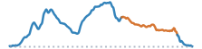
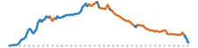
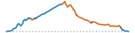
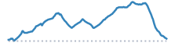

## Snapshot

### Route Summaries
```{=html}
<div class="route-browser">
<div class="mobile-route-controls">
<div class="mobile-route-control">
<label for="mobile-route-sort">Sort routes</label>
<select id="mobile-route-sort" class="form-select">
<option value="miles_asc">Miles: shortest</option>
<option value="miles_desc">Miles: longest</option>
<option value="elev_asc">Elevation: lowest</option>
<option value="elev_desc">Elevation: highest</option>
<option value="time_asc">Time: shortest</option>
<option value="time_desc">Time: longest</option>
<option value="road_quality_desc">Road Quality: highest</option>
<option value="road_quality_asc">Road Quality: lowest</option>
</select>
</div>
<div class="mobile-route-control">
<label for="mobile-route-bart">BART station</label>
<select id="mobile-route-bart" class="form-select">
<option value="">All stations</option>
<option value="North Berkeley">North Berkeley</option>
<option value="Union City">Union City</option>
<option value="MacArthur">MacArthur</option>
<option value="San Leandro">San Leandro</option>
<option value="Richmond">Richmond</option>
<option value="El Cerrito del Norte">El Cerrito del Norte</option>
</select>
</div>
<div class="mobile-route-control">
<fieldset class="mobile-route-radio-control">
<legend>Gravel</legend>
<label><input type="radio" name="mobile-route-gravel" value="include" checked> W/ gravel</label>
<label><input type="radio" name="mobile-route-gravel" value="exclude"> No gravel</label>
</fieldset>
</div>
</div>
<div class="mobile-route-grid" id="mobile-route-grid">
<article class="mobile-route-card" data-bart="North Berkeley" data-miles="11.59" data-elevation="1246.39" data-time="78" data-road-quality="82" data-has-gravel="false">
<div class="mobile-route-heading">
<p class="mobile-route-title"><a style="color:DodgerBlue;" href="routes/spruce-up-euclid-down.html">Short Spr-euclid</a></p>
<div class="mobile-route-tags"><span class="mobile-route-tag">Spruce ↑</span><span class="mobile-route-tag">Euclid ↓</span></div>
</div>
<div class="mobile-route-elevation" aria-hidden="true"></div>
<div class="mobile-route-metrics">
<p><span class="mobile-route-label">BART</span><br>North Berkeley</p>
<p><span class="mobile-route-label">Miles</span><br>11.59</p>
<p><span class="mobile-route-label">Elev. Gain</span><br>1246.39 ft</p>
<p><span class="mobile-route-label">Time</span><br>~1:20</p>
<p><span class="mobile-route-label">Steep Descent</span><br>0.07 mi</p>
<p><span class="mobile-route-label">Road Quality</span><br><span class="mobile-route-quality" style="background-color:#91cf60;">82%</span></p>
</div>
</article>
<article class="mobile-route-card" data-bart="North Berkeley" data-miles="13.91" data-elevation="1747.70" data-time="95" data-road-quality="78" data-has-gravel="false">
<div class="mobile-route-heading">
<p class="mobile-route-title"><a style="color:DodgerBlue;" href="routes/grizzly-peak-loop.html">Grizzly Peak Loop</a></p>
<div class="mobile-route-tags"><span class="mobile-route-tag">Spruce ↑</span><span class="mobile-route-tag">Grizzly Peak ↑</span><span class="mobile-route-tag">Claremont ↓</span></div>
</div>
<div class="mobile-route-elevation" aria-hidden="true"></div>
<div class="mobile-route-metrics">
<p><span class="mobile-route-label">BART</span><br>North Berkeley</p>
<p><span class="mobile-route-label">Miles</span><br>13.91</p>
<p><span class="mobile-route-label">Elev. Gain</span><br>1747.7 ft</p>
<p><span class="mobile-route-label">Time</span><br>~1:40</p>
<p><span class="mobile-route-label">Steep Descent</span><br>0.14 mi</p>
<p><span class="mobile-route-label">Road Quality</span><br><span class="mobile-route-quality" style="background-color:#91cf60;">78%</span></p>
</div>
</article>
<article class="mobile-route-card" data-bart="MacArthur" data-miles="14.16" data-elevation="1716.54" data-time="98" data-road-quality="52" data-has-gravel="false">
<div class="mobile-route-heading">
<p class="mobile-route-title"><a style="color:DodgerBlue;" href="routes/tunnel-to-claremont-loop.html">Quick Tunnel Trip</a></p>
<div class="mobile-route-tags"><span class="mobile-route-tag">Tunnel ↑</span><span class="mobile-route-tag">Claremont ↓</span></div>
</div>
<div class="mobile-route-elevation" aria-hidden="true"></div>
<div class="mobile-route-metrics">
<p><span class="mobile-route-label">BART</span><br>MacArthur</p>
<p><span class="mobile-route-label">Miles</span><br>14.16</p>
<p><span class="mobile-route-label">Elev. Gain</span><br>1716.54 ft</p>
<p><span class="mobile-route-label">Time</span><br>~1:40</p>
<p><span class="mobile-route-label">Steep Descent</span><br>0.13 mi</p>
<p><span class="mobile-route-label">Road Quality</span><br><span class="mobile-route-quality" style="background-color:#ffffbf;">52%</span></p>
</div>
</article>
<article class="mobile-route-card" data-bart="El Cerrito del Norte" data-miles="18.05" data-elevation="2176.84" data-time="122" data-road-quality="32" data-has-gravel="true">
<div class="mobile-route-heading">
<p class="mobile-route-title"><a style="color:DodgerBlue;" href="routes/wildcat-conlon-nimitz-meadow-loop.html">Conlon Trail Loop <span><span style="color: chocolate;">(59% Gravel)</span></span></a></p>
<div class="mobile-route-tags"><span class="mobile-route-tag">Wildcat Creek</span><span class="mobile-route-tag">Conlon Trail ↑</span><span class="mobile-route-tag">Meadows Canyon ↓</span></div>
</div>
<div class="mobile-route-elevation" aria-hidden="true"></div>
<div class="mobile-route-metrics">
<p><span class="mobile-route-label">BART</span><br>El Cerrito del Norte</p>
<p><span class="mobile-route-label">Miles</span><br>18.05</p>
<p><span class="mobile-route-label">Elev. Gain</span><br>2176.84 ft</p>
<p><span class="mobile-route-label">Time</span><br>~2:00</p>
<p><span class="mobile-route-label">Steep Descent</span><br>0.32 mi</p>
<p><span class="mobile-route-label">Road Quality</span><br><span class="mobile-route-quality" style="background-color:#fee08b;">32%</span></p>
</div>
</article>
<article class="mobile-route-card" data-bart="El Cerrito del Norte" data-miles="18.83" data-elevation="2072.18" data-time="122" data-road-quality="29" data-has-gravel="true">
<div class="mobile-route-heading">
<p class="mobile-route-title"><a style="color:DodgerBlue;" href="routes/wildcat-havey-nimitz-meadow-loop.html">Havey Canyon Loop <span><span style="color: chocolate;">(53% Gravel)</span></span></a></p>
<div class="mobile-route-tags"><span class="mobile-route-tag">Wildcat Creek ↓</span><span class="mobile-route-tag">Havey Canyon ↑</span><span class="mobile-route-tag">Meadows Canyon ↓</span></div>
</div>
<div class="mobile-route-elevation" aria-hidden="true"></div>
<div class="mobile-route-metrics">
<p><span class="mobile-route-label">BART</span><br>El Cerrito del Norte</p>
<p><span class="mobile-route-label">Miles</span><br>18.83</p>
<p><span class="mobile-route-label">Elev. Gain</span><br>2072.18 ft</p>
<p><span class="mobile-route-label">Time</span><br>~2:00</p>
<p><span class="mobile-route-label">Steep Descent</span><br>0.30 mi</p>
<p><span class="mobile-route-label">Road Quality</span><br><span class="mobile-route-quality" style="background-color:#fee08b;">29%</span></p>
</div>
</article>
<article class="mobile-route-card" data-bart="MacArthur" data-miles="19.49" data-elevation="2646.00" data-time="138" data-road-quality="55" data-has-gravel="false">
<div class="mobile-route-heading">
<p class="mobile-route-title"><a style="color:DodgerBlue;" href="routes/wildwood-bbr-loop.html">OAK Hills Loop</a></p>
<div class="mobile-route-tags"><span class="mobile-route-tag">Wildwood+Leimert ↑</span><span class="mobile-route-tag">Butters Canyon ↑</span><span class="mobile-route-tag">Claremont ↓</span></div>
</div>
<div class="mobile-route-elevation" aria-hidden="true"></div>
<div class="mobile-route-metrics">
<p><span class="mobile-route-label">BART</span><br>MacArthur</p>
<p><span class="mobile-route-label">Miles</span><br>19.49</p>
<p><span class="mobile-route-label">Elev. Gain</span><br>2646.0 ft</p>
<p><span class="mobile-route-label">Time</span><br>~2:20</p>
<p><span class="mobile-route-label">Steep Descent</span><br>0.14 mi</p>
<p><span class="mobile-route-label">Road Quality</span><br><span class="mobile-route-quality" style="background-color:#d9ef8b;">55%</span></p>
</div>
</article>
<article class="mobile-route-card" data-bart="El Cerrito del Norte" data-miles="19.86" data-elevation="3048.56" data-time="144" data-road-quality="79" data-has-gravel="true">
<div class="mobile-route-heading">
<p class="mobile-route-title"><a style="color:DodgerBlue;" href="routes/arlington-to-wildcat-creek.html">Arli-spruce <span><span style="color: chocolate;">(25% Gravel)</span></span></a></p>
<div class="mobile-route-tags"><span class="mobile-route-tag">Arlington ↑</span><span class="mobile-route-tag">Spruce ↑</span><span class="mobile-route-tag">Wildcat Creek ↓</span></div>
</div>
<div class="mobile-route-elevation" aria-hidden="true"></div>
<div class="mobile-route-metrics">
<p><span class="mobile-route-label">BART</span><br>El Cerrito del Norte</p>
<p><span class="mobile-route-label">Miles</span><br>19.86</p>
<p><span class="mobile-route-label">Elev. Gain</span><br>3048.56 ft</p>
<p><span class="mobile-route-label">Time</span><br>~2:20</p>
<p><span class="mobile-route-label">Steep Descent</span><br>0.25 mi</p>
<p><span class="mobile-route-label">Road Quality</span><br><span class="mobile-route-quality" style="background-color:#91cf60;">79%</span></p>
</div>
</article>
<article class="mobile-route-card" data-bart="El Cerrito del Norte" data-miles="20.09" data-elevation="3712.93" data-time="153" data-road-quality="74" data-has-gravel="true">
<div class="mobile-route-heading">
<p class="mobile-route-title"><a style="color:DodgerBlue;" href="routes/arlington-to-southpark.html">Arli-griz to Golf <span><span style="color: chocolate;">(46% Gravel)</span></span></a></p>
<div class="mobile-route-tags"><span class="mobile-route-tag">Arlington ↑</span><span class="mobile-route-tag">Golf Course Trail</span><span class="mobile-route-tag">Meadows Canyon ↓</span><span class="mobile-route-tag">Wildcat Creek ↓</span></div>
</div>
<div class="mobile-route-elevation" aria-hidden="true"></div>
<div class="mobile-route-metrics">
<p><span class="mobile-route-label">BART</span><br>El Cerrito del Norte</p>
<p><span class="mobile-route-label">Miles</span><br>20.09</p>
<p><span class="mobile-route-label">Elev. Gain</span><br>3712.93 ft</p>
<p><span class="mobile-route-label">Time</span><br>~2:30</p>
<p><span class="mobile-route-label">Steep Descent</span><br>0.61 mi</p>
<p><span class="mobile-route-label">Road Quality</span><br><span class="mobile-route-quality" style="background-color:#91cf60;">74%</span></p>
</div>
</article>
<article class="mobile-route-card" data-bart="El Cerrito del Norte" data-miles="23.94" data-elevation="4072.51" data-time="179" data-road-quality="76" data-has-gravel="true">
<div class="mobile-route-heading">
<p class="mobile-route-title"><a style="color:DodgerBlue;" href="routes/arlington-to-vollmer.html">Arli-griz to Vollmer <span><span style="color: chocolate;">(42% Gravel)</span></span></a></p>
<div class="mobile-route-tags"><span class="mobile-route-tag">Arlington ↑</span><span class="mobile-route-tag">Grizzly Peak ↑</span><span class="mobile-route-tag">Seaview ↓</span><span class="mobile-route-tag">Meadows Canyon ↓</span><span class="mobile-route-tag">Wildcat Creek ↓</span></div>
</div>
<div class="mobile-route-elevation" aria-hidden="true"></div>
<div class="mobile-route-metrics">
<p><span class="mobile-route-label">BART</span><br>El Cerrito del Norte</p>
<p><span class="mobile-route-label">Miles</span><br>23.94</p>
<p><span class="mobile-route-label">Elev. Gain</span><br>4072.51 ft</p>
<p><span class="mobile-route-label">Time</span><br>~3:00</p>
<p><span class="mobile-route-label">Steep Descent</span><br>0.80 mi</p>
<p><span class="mobile-route-label">Road Quality</span><br><span class="mobile-route-quality" style="background-color:#91cf60;">76%</span></p>
</div>
</article>
<article class="mobile-route-card" data-bart="San Leandro" data-miles="24.55" data-elevation="2958.33" data-time="167" data-road-quality="84" data-has-gravel="false">
<div class="mobile-route-heading">
<p class="mobile-route-title"><a style="color:DodgerBlue;" href="routes/redwood-san-leandro-macarthur-bart.html">Redwood to Temescal</a></p>
<div class="mobile-route-tags"><span class="mobile-route-tag">Redwood Road ↑</span><span class="mobile-route-tag">Wildwood+Leimert ↓</span></div>
</div>
<div class="mobile-route-elevation" aria-hidden="true"></div>
<div class="mobile-route-metrics">
<p><span class="mobile-route-label">BART</span><br>San Leandro</p>
<p><span class="mobile-route-label">Miles</span><br>24.55</p>
<p><span class="mobile-route-label">Elev. Gain</span><br>2958.33 ft</p>
<p><span class="mobile-route-label">Time</span><br>~2:50</p>
<p><span class="mobile-route-label">Steep Descent</span><br>0.25 mi</p>
<p><span class="mobile-route-label">Road Quality</span><br><span class="mobile-route-quality" style="background-color:#91cf60;">84%</span></p>
</div>
</article>
<article class="mobile-route-card" data-bart="Union City" data-miles="25.21" data-elevation="548.88" data-time="135" data-road-quality="34" data-has-gravel="true">
<div class="mobile-route-heading">
<p class="mobile-route-title"><a style="color:DodgerBlue;" href="routes/coyote-union-city.html">Coyote Hills Loop <span><span style="color: chocolate;">(78% Gravel)</span></span></a></p>
<div class="mobile-route-tags"><span class="mobile-route-tag">Alameda Creek</span></div>
</div>
<div class="mobile-route-elevation" aria-hidden="true"></div>
<div class="mobile-route-metrics">
<p><span class="mobile-route-label">BART</span><br>Union City</p>
<p><span class="mobile-route-label">Miles</span><br>25.21</p>
<p><span class="mobile-route-label">Elev. Gain</span><br>548.88 ft</p>
<p><span class="mobile-route-label">Time</span><br>~2:20</p>
<p><span class="mobile-route-label">Steep Descent</span><br>0.07 mi</p>
<p><span class="mobile-route-label">Road Quality</span><br><span class="mobile-route-quality" style="background-color:#fee08b;">34%</span></p>
</div>
</article>
<article class="mobile-route-card" data-bart="MacArthur" data-miles="25.60" data-elevation="3435.70" data-time="181" data-road-quality="78" data-has-gravel="false">
<div class="mobile-route-heading">
<p class="mobile-route-title"><a style="color:DodgerBlue;" href="routes/oak-hills-pinehurst.html">OAK Hills Loop +</a></p>
<div class="mobile-route-tags"><span class="mobile-route-tag">Wildwood+Leimert ↑</span><span class="mobile-route-tag">Butters Canyon ↑</span><span class="mobile-route-tag">Pinehurst ↑</span><span class="mobile-route-tag">Claremont ↓</span></div>
</div>
<div class="mobile-route-elevation" aria-hidden="true"></div>
<div class="mobile-route-metrics">
<p><span class="mobile-route-label">BART</span><br>MacArthur</p>
<p><span class="mobile-route-label">Miles</span><br>25.6</p>
<p><span class="mobile-route-label">Elev. Gain</span><br>3435.7 ft</p>
<p><span class="mobile-route-label">Time</span><br>~3:00</p>
<p><span class="mobile-route-label">Steep Descent</span><br>0.18 mi</p>
<p><span class="mobile-route-label">Road Quality</span><br><span class="mobile-route-quality" style="background-color:#91cf60;">78%</span></p>
</div>
</article>
<article class="mobile-route-card" data-bart="Richmond" data-miles="29.66" data-elevation="1466.86" data-time="170" data-road-quality="18" data-has-gravel="false">
<div class="mobile-route-heading">
<p class="mobile-route-title"><a style="color:DodgerBlue;" href="routes/richmond-marin-conzelman-emb.html">Richmond to EMB <span><span style="color: forestgreen;">(49% Cycleway)</span></span></a></p>
<div class="mobile-route-tags"><span class="mobile-route-tag">Richmond Bridge</span><span class="mobile-route-tag">Golden Gate Bridge</span></div>
</div>
<div class="mobile-route-elevation" aria-hidden="true"></div>
<div class="mobile-route-metrics">
<p><span class="mobile-route-label">BART</span><br>Richmond</p>
<p><span class="mobile-route-label">Miles</span><br>29.66</p>
<p><span class="mobile-route-label">Elev. Gain</span><br>1466.86 ft</p>
<p><span class="mobile-route-label">Time</span><br>~2:50</p>
<p><span class="mobile-route-label">Steep Descent</span><br>0.07 mi</p>
<p><span class="mobile-route-label">Road Quality</span><br><span class="mobile-route-quality" style="background-color:#fc8d59;">18%</span></p>
</div>
</article>
<article class="mobile-route-card" data-bart="El Cerrito del Norte" data-miles="31.54" data-elevation="5423.88" data-time="219" data-road-quality="91" data-has-gravel="true">
<div class="mobile-route-heading">
<p class="mobile-route-title"><a style="color:DodgerBlue;" href="routes/three-bears-gravel-loop.html">Three Wild Bears <span><span style="color: chocolate;">(20% Gravel)</span></span></a></p>
<div class="mobile-route-tags"><span class="mobile-route-tag">3 Bears</span><span class="mobile-route-tag">Meadows Canyon ↓</span><span class="mobile-route-tag">Wildcat Creek ↓</span></div>
</div>
<div class="mobile-route-elevation" aria-hidden="true"></div>
<div class="mobile-route-metrics">
<p><span class="mobile-route-label">BART</span><br>El Cerrito del Norte</p>
<p><span class="mobile-route-label">Miles</span><br>31.54</p>
<p><span class="mobile-route-label">Elev. Gain</span><br>5423.88 ft</p>
<p><span class="mobile-route-label">Time</span><br>~3:40</p>
<p><span class="mobile-route-label">Steep Descent</span><br>1.27 mi</p>
<p><span class="mobile-route-label">Road Quality</span><br><span class="mobile-route-quality" style="background-color:#1a9850;">91%</span></p>
</div>
</article>
<article class="mobile-route-card" data-bart="San Leandro" data-miles="38.61" data-elevation="5624.67" data-time="271" data-road-quality="76" data-has-gravel="true">
<div class="mobile-route-heading">
<p class="mobile-route-title"><a style="color:DodgerBlue;" href="routes/big-redwood-to-tilden.html">Redwood to Richmond <span><span style="color: chocolate;">(24% Gravel)</span></span></a></p>
<div class="mobile-route-tags"><span class="mobile-route-tag">Redwood Road ↑</span><span class="mobile-route-tag">Seaview ↓</span><span class="mobile-route-tag">Meadows Canyon ↓</span><span class="mobile-route-tag">Wildcat Creek ↓</span></div>
</div>
<div class="mobile-route-elevation" aria-hidden="true"></div>
<div class="mobile-route-metrics">
<p><span class="mobile-route-label">BART</span><br>San Leandro</p>
<p><span class="mobile-route-label">Miles</span><br>38.61</p>
<p><span class="mobile-route-label">Elev. Gain</span><br>5624.67 ft</p>
<p><span class="mobile-route-label">Time</span><br>~4:30</p>
<p><span class="mobile-route-label">Steep Descent</span><br>0.88 mi</p>
<p><span class="mobile-route-label">Road Quality</span><br><span class="mobile-route-quality" style="background-color:#91cf60;">76%</span></p>
</div>
</article>
</div>
</div>
```
