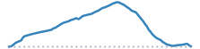
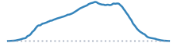
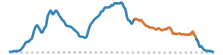
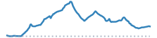
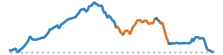
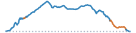
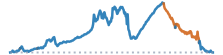

## Snapshot

### Route Summaries
```{=html}
<div class="route-browser">
<div class="mobile-route-controls">
<div class="mobile-route-control">
<label for="mobile-route-sort">Sort routes</label>
<select id="mobile-route-sort" class="form-select">
<option value="miles_asc">Miles: shortest</option>
<option value="miles_desc">Miles: longest</option>
<option value="elev_asc">Elevation: lowest</option>
<option value="elev_desc">Elevation: highest</option>
<option value="time_asc">Time: shortest</option>
<option value="time_desc">Time: longest</option>
<option value="danger_zone_asc">Danger Zone: shortest</option>
<option value="danger_zone_desc">Danger Zone: longest</option>
<option value="road_quality_desc">Road Quality: highest</option>
<option value="road_quality_asc">Road Quality: lowest</option>
</select>
</div>
<div class="mobile-route-control">
<label for="mobile-route-bart">BART station</label>
<select id="mobile-route-bart" class="form-select">
<option value="">All stations</option>
<option value="Lake Merritt">Lake Merritt</option>
<option value="Fruitvale">Fruitvale</option>
<option value="Union City">Union City</option>
<option value="Richmond">Richmond</option>
<option value="San Leandro">San Leandro</option>
<option value="Civic Center/UN Plaza">Civic Center/UN Plaza</option>
<option value="El Cerrito del Norte">El Cerrito del Norte</option>
<option value="MacArthur">MacArthur</option>
<option value="North Berkeley">North Berkeley</option>
</select>
</div>
<div class="mobile-route-control">
<fieldset class="mobile-route-radio-control">
<legend>Gravel</legend>
<label><input type="radio" name="mobile-route-gravel" value="include" checked> W/ gravel</label>
<label><input type="radio" name="mobile-route-gravel" value="exclude"> No gravel</label>
</fieldset>
</div>
</div>
<div class="mobile-route-grid" id="mobile-route-grid">
<article class="mobile-route-card" data-bart="North Berkeley" data-miles="13.91" data-elevation="1665.00" data-time="95" data-danger-zone="0.00" data-road-quality="78" data-has-gravel="false">
<div class="mobile-route-heading">
<p class="mobile-route-title"><a style="color:DodgerBlue;" href="routes/grizzly-peak-loop.html">Grizzly Peak Loop</a></p>
<div class="mobile-route-tags"><span class="mobile-route-tag">Spruce ↑</span><span class="mobile-route-tag">Grizzly Peak ↑</span><span class="mobile-route-tag">Claremont ↓</span></div>
</div>
<div class="mobile-route-elevation" aria-hidden="true"></div>
<div class="mobile-route-metrics">
<p><span class="mobile-route-label">BART</span><br>North Berkeley</p>
<p><span class="mobile-route-label">Miles</span><br>13.91</p>
<p><span class="mobile-route-label">Elev. Gain</span><br>1665.0 ft</p>
<p><span class="mobile-route-label">Time</span><br>~1:40</p>
<p><span class="mobile-route-label">Danger Zone</span><br>0.00 mi</p>
<p><span class="mobile-route-label">Road Quality</span><br><span class="mobile-route-quality" style="background-color:#91cf60;">78%</span></p>
</div>
</article>
<article class="mobile-route-card" data-bart="MacArthur" data-miles="14.16" data-elevation="1452.00" data-time="98" data-danger-zone="0.00" data-road-quality="52" data-has-gravel="false">
<div class="mobile-route-heading">
<p class="mobile-route-title"><a style="color:DodgerBlue;" href="routes/tunnel-to-claremont-loop.html">Quick Tunnel Trip</a></p>
<div class="mobile-route-tags"><span class="mobile-route-tag">Tunnel ↑</span><span class="mobile-route-tag">Claremont ↓</span></div>
</div>
<div class="mobile-route-elevation" aria-hidden="true"></div>
<div class="mobile-route-metrics">
<p><span class="mobile-route-label">BART</span><br>MacArthur</p>
<p><span class="mobile-route-label">Miles</span><br>14.16</p>
<p><span class="mobile-route-label">Elev. Gain</span><br>1452.0 ft</p>
<p><span class="mobile-route-label">Time</span><br>~1:40</p>
<p><span class="mobile-route-label">Danger Zone</span><br>0.00 mi</p>
<p><span class="mobile-route-label">Road Quality</span><br><span class="mobile-route-quality" style="background-color:#ffffbf;">52%</span></p>
</div>
</article>
<article class="mobile-route-card" data-bart="El Cerrito del Norte" data-miles="17.84" data-elevation="1588.00" data-time="130" data-danger-zone="2.00" data-road-quality="42" data-has-gravel="true">
<div class="mobile-route-heading">
<p class="mobile-route-title"><a style="color:DodgerBlue;" href="routes/weeknight-alvarado-meadows-conlon.html">Weeknight Alvarado Up-Downer <span><span style="color: chocolate;">(60% Gravel)</span></span></a></p>
<div class="mobile-route-tags"><span class="mobile-route-tag">Wildcat Creek ↑</span><span class="mobile-route-tag">Meadows Canyon ↑</span><span class="mobile-route-tag">Conlon Trail ↓</span><span class="mobile-route-tag">Wildcat Creek</span></div>
</div>
<div class="mobile-route-elevation" aria-hidden="true"></div>
<div class="mobile-route-metrics">
<p><span class="mobile-route-label">BART</span><br>El Cerrito del Norte</p>
<p><span class="mobile-route-label">Miles</span><br>17.84</p>
<p><span class="mobile-route-label">Elev. Gain</span><br>1588.0 ft</p>
<p><span class="mobile-route-label">Time</span><br>~2:10</p>
<p><span class="mobile-route-label">Danger Zone</span><br>2.00 mi</p>
<p><span class="mobile-route-label">Road Quality</span><br><span class="mobile-route-quality" style="background-color:#ffffbf;">42%</span></p>
</div>
</article>
<article class="mobile-route-card" data-bart="MacArthur" data-miles="19.47" data-elevation="1980.00" data-time="137" data-danger-zone="0.00" data-road-quality="54" data-has-gravel="false">
<div class="mobile-route-heading">
<p class="mobile-route-title"><a style="color:DodgerBlue;" href="routes/wildwood-bbr-loop.html">OAK Hills Loop</a></p>
<div class="mobile-route-tags"><span class="mobile-route-tag">Wildwood+Leimert ↑</span><span class="mobile-route-tag">Butters Canyon ↑</span><span class="mobile-route-tag">Skyline ↑</span><span class="mobile-route-tag">Claremont ↓</span></div>
</div>
<div class="mobile-route-elevation" aria-hidden="true"></div>
<div class="mobile-route-metrics">
<p><span class="mobile-route-label">BART</span><br>MacArthur</p>
<p><span class="mobile-route-label">Miles</span><br>19.47</p>
<p><span class="mobile-route-label">Elev. Gain</span><br>1980.0 ft</p>
<p><span class="mobile-route-label">Time</span><br>~2:20</p>
<p><span class="mobile-route-label">Danger Zone</span><br>0.00 mi</p>
<p><span class="mobile-route-label">Road Quality</span><br><span class="mobile-route-quality" style="background-color:#ffffbf;">54%</span></p>
</div>
</article>
<article class="mobile-route-card" data-bart="El Cerrito del Norte" data-miles="19.86" data-elevation="1816.00" data-time="144" data-danger-zone="1.50" data-road-quality="79" data-has-gravel="true">
<div class="mobile-route-heading">
<p class="mobile-route-title"><a style="color:DodgerBlue;" href="routes/arlington-to-wildcat-creek.html">Arli-spruce <span><span style="color: chocolate;">(25% Gravel)</span></span></a></p>
<div class="mobile-route-tags"><span class="mobile-route-tag">Arlington ↑</span><span class="mobile-route-tag">Spruce ↑</span><span class="mobile-route-tag">Wildcat Creek ↓</span></div>
</div>
<div class="mobile-route-elevation" aria-hidden="true"></div>
<div class="mobile-route-metrics">
<p><span class="mobile-route-label">BART</span><br>El Cerrito del Norte</p>
<p><span class="mobile-route-label">Miles</span><br>19.86</p>
<p><span class="mobile-route-label">Elev. Gain</span><br>1816.0 ft</p>
<p><span class="mobile-route-label">Time</span><br>~2:20</p>
<p><span class="mobile-route-label">Danger Zone</span><br>1.50 mi</p>
<p><span class="mobile-route-label">Road Quality</span><br><span class="mobile-route-quality" style="background-color:#91cf60;">79%</span></p>
</div>
</article>
<article class="mobile-route-card" data-bart="Lake Merritt" data-miles="23.70" data-elevation="1905.00" data-time="158" data-danger-zone="0.00" data-road-quality="54" data-has-gravel="false">
<div class="mobile-route-heading">
<p class="mobile-route-title"><a style="color:DodgerBlue;" href="routes/merrit-to-lamorinda.html">Lake Merritt to Lamorinda <span><span style="color: forestgreen;">(27% Cycleway)</span></span></a></p>
<div class="mobile-route-tags"><span class="mobile-route-tag">Wildwood+Leimert ↑</span><span class="mobile-route-tag">Butters Canyon ↑</span><span class="mobile-route-tag">La-Moraga Trail</span></div>
</div>
<div class="mobile-route-elevation" aria-hidden="true"></div>
<div class="mobile-route-metrics">
<p><span class="mobile-route-label">BART</span><br>Lake Merritt</p>
<p><span class="mobile-route-label">Miles</span><br>23.7</p>
<p><span class="mobile-route-label">Elev. Gain</span><br>1905.0 ft</p>
<p><span class="mobile-route-label">Time</span><br>~2:40</p>
<p><span class="mobile-route-label">Danger Zone</span><br>0.00 mi</p>
<p><span class="mobile-route-label">Road Quality</span><br><span class="mobile-route-quality" style="background-color:#ffffbf;">54%</span></p>
</div>
</article>
<article class="mobile-route-card" data-bart="MacArthur" data-miles="24.39" data-elevation="2301.00" data-time="172" data-danger-zone="1.40" data-road-quality="57" data-has-gravel="true">
<div class="mobile-route-heading">
<p class="mobile-route-title"><a style="color:DodgerBlue;" href="routes/bbr-skyline-brandon.html">OAK Hills round Lake Chabot <span><span style="color: chocolate;">(20% Gravel)</span></span></a></p>
<div class="mobile-route-tags"><span class="mobile-route-tag">Wildwood+Leimert ↑</span><span class="mobile-route-tag">Butters Canyon ↑</span><span class="mobile-route-tag">Skyline ↓</span><span class="mobile-route-tag">Brandon Trail ↑</span><span class="mobile-route-tag">Lake Chabot</span></div>
</div>
<div class="mobile-route-elevation" aria-hidden="true"></div>
<div class="mobile-route-metrics">
<p><span class="mobile-route-label">BART</span><br>MacArthur</p>
<p><span class="mobile-route-label">Miles</span><br>24.39</p>
<p><span class="mobile-route-label">Elev. Gain</span><br>2301.0 ft</p>
<p><span class="mobile-route-label">Time</span><br>~2:50</p>
<p><span class="mobile-route-label">Danger Zone</span><br>1.40 mi</p>
<p><span class="mobile-route-label">Road Quality</span><br><span class="mobile-route-quality" style="background-color:#d9ef8b;">57%</span></p>
</div>
</article>
<article class="mobile-route-card" data-bart="San Leandro" data-miles="24.55" data-elevation="2324.00" data-time="166" data-danger-zone="0.00" data-road-quality="84" data-has-gravel="false">
<div class="mobile-route-heading">
<p class="mobile-route-title"><a style="color:DodgerBlue;" href="routes/redwood-san-leandro-macarthur-bart.html">Redwood to Temescal</a></p>
<div class="mobile-route-tags"><span class="mobile-route-tag">Lake Chabot</span><span class="mobile-route-tag">Redwood Road ↑</span><span class="mobile-route-tag">Joaquin Miller ↓</span><span class="mobile-route-tag">Wildwood+Leimert ↓</span></div>
</div>
<div class="mobile-route-elevation" aria-hidden="true"></div>
<div class="mobile-route-metrics">
<p><span class="mobile-route-label">BART</span><br>San Leandro</p>
<p><span class="mobile-route-label">Miles</span><br>24.55</p>
<p><span class="mobile-route-label">Elev. Gain</span><br>2324.0 ft</p>
<p><span class="mobile-route-label">Time</span><br>~2:50</p>
<p><span class="mobile-route-label">Danger Zone</span><br>0.00 mi</p>
<p><span class="mobile-route-label">Road Quality</span><br><span class="mobile-route-quality" style="background-color:#91cf60;">84%</span></p>
</div>
</article>
<article class="mobile-route-card" data-bart="Civic Center/UN Plaza" data-miles="25.12" data-elevation="1918.00" data-time="166" data-danger-zone="1.50" data-road-quality="26" data-has-gravel="false">
<div class="mobile-route-heading">
<p class="mobile-route-title"><a style="color:DodgerBlue;" href="routes/weeknight-bonita.html">Point Bonita Loop</a></p>
<div class="mobile-route-tags"><span class="mobile-route-tag">Hawk Hill ↑</span><span class="mobile-route-tag">Hawk Hill ↓</span><span class="mobile-route-tag">Golden Gate Bridge</span></div>
</div>
<div class="mobile-route-elevation" aria-hidden="true"></div>
<div class="mobile-route-metrics">
<p><span class="mobile-route-label">BART</span><br>Civic Center/UN Plaza</p>
<p><span class="mobile-route-label">Miles</span><br>25.12</p>
<p><span class="mobile-route-label">Elev. Gain</span><br>1918.0 ft</p>
<p><span class="mobile-route-label">Time</span><br>~2:50</p>
<p><span class="mobile-route-label">Danger Zone</span><br>1.50 mi</p>
<p><span class="mobile-route-label">Road Quality</span><br><span class="mobile-route-quality" style="background-color:#fee08b;">26%</span></p>
</div>
</article>
<article class="mobile-route-card" data-bart="Union City" data-miles="25.21" data-elevation="209.00" data-time="135" data-danger-zone="0.30" data-road-quality="22" data-has-gravel="true">
<div class="mobile-route-heading">
<p class="mobile-route-title"><a style="color:DodgerBlue;" href="routes/coyote-union-city.html">Coyote Hills Loop <span><span style="color: chocolate;">(66% Gravel)</span></span></a></p>
<div class="mobile-route-tags"><span class="mobile-route-tag">Shoreline Trail</span><span class="mobile-route-tag">Alameda Creek</span></div>
</div>
<div class="mobile-route-elevation" aria-hidden="true"></div>
<div class="mobile-route-metrics">
<p><span class="mobile-route-label">BART</span><br>Union City</p>
<p><span class="mobile-route-label">Miles</span><br>25.21</p>
<p><span class="mobile-route-label">Elev. Gain</span><br>209.0 ft</p>
<p><span class="mobile-route-label">Time</span><br>~2:20</p>
<p><span class="mobile-route-label">Danger Zone</span><br>0.30 mi</p>
<p><span class="mobile-route-label">Road Quality</span><br><span class="mobile-route-quality" style="background-color:#fc8d59;">22%</span></p>
</div>
</article>
<article class="mobile-route-card" data-bart="MacArthur" data-miles="25.60" data-elevation="2598.00" data-time="180" data-danger-zone="0.00" data-road-quality="78" data-has-gravel="false">
<div class="mobile-route-heading">
<p class="mobile-route-title"><a style="color:DodgerBlue;" href="routes/oak-hills-pinehurst.html">OAK Hills Loop +</a></p>
<div class="mobile-route-tags"><span class="mobile-route-tag">Wildwood+Leimert ↑</span><span class="mobile-route-tag">Butters Canyon ↑</span><span class="mobile-route-tag">Pinehurst ↑</span><span class="mobile-route-tag">Claremont ↓</span></div>
</div>
<div class="mobile-route-elevation" aria-hidden="true"></div>
<div class="mobile-route-metrics">
<p><span class="mobile-route-label">BART</span><br>MacArthur</p>
<p><span class="mobile-route-label">Miles</span><br>25.6</p>
<p><span class="mobile-route-label">Elev. Gain</span><br>2598.0 ft</p>
<p><span class="mobile-route-label">Time</span><br>~3:00</p>
<p><span class="mobile-route-label">Danger Zone</span><br>0.00 mi</p>
<p><span class="mobile-route-label">Road Quality</span><br><span class="mobile-route-quality" style="background-color:#91cf60;">78%</span></p>
</div>
</article>
<article class="mobile-route-card" data-bart="MacArthur" data-miles="27.15" data-elevation="2589.00" data-time="186" data-danger-zone="0.80" data-road-quality="70" data-has-gravel="true">
<div class="mobile-route-heading">
<p class="mobile-route-title"><a style="color:DodgerBlue;" href="routes/bbr-skyline-chabot.html">OAK Hills Ridge Ride <span><span style="color: chocolate;">(11% Gravel)</span></span></a></p>
<div class="mobile-route-tags"><span class="mobile-route-tag">Tunnel ↑</span><span class="mobile-route-tag">Pinehurst ↓</span><span class="mobile-route-tag">Goldenrod Trail ↓</span></div>
</div>
<div class="mobile-route-elevation" aria-hidden="true"></div>
<div class="mobile-route-metrics">
<p><span class="mobile-route-label">BART</span><br>MacArthur</p>
<p><span class="mobile-route-label">Miles</span><br>27.15</p>
<p><span class="mobile-route-label">Elev. Gain</span><br>2589.0 ft</p>
<p><span class="mobile-route-label">Time</span><br>~3:10</p>
<p><span class="mobile-route-label">Danger Zone</span><br>0.80 mi</p>
<p><span class="mobile-route-label">Road Quality</span><br><span class="mobile-route-quality" style="background-color:#91cf60;">70%</span></p>
</div>
</article>
<article class="mobile-route-card" data-bart="Richmond" data-miles="29.66" data-elevation="938.00" data-time="170" data-danger-zone="0.00" data-road-quality="18" data-has-gravel="false">
<div class="mobile-route-heading">
<p class="mobile-route-title"><a style="color:DodgerBlue;" href="routes/richmond-marin-conzelman-emb.html">Richmond to EMB <span><span style="color: forestgreen;">(49% Cycleway)</span></span></a></p>
<div class="mobile-route-tags"><span class="mobile-route-tag">Richmond Bridge</span><span class="mobile-route-tag">Golden Gate Bridge</span></div>
</div>
<div class="mobile-route-elevation" aria-hidden="true"></div>
<div class="mobile-route-metrics">
<p><span class="mobile-route-label">BART</span><br>Richmond</p>
<p><span class="mobile-route-label">Miles</span><br>29.66</p>
<p><span class="mobile-route-label">Elev. Gain</span><br>938.0 ft</p>
<p><span class="mobile-route-label">Time</span><br>~2:50</p>
<p><span class="mobile-route-label">Danger Zone</span><br>0.00 mi</p>
<p><span class="mobile-route-label">Road Quality</span><br><span class="mobile-route-quality" style="background-color:#fc8d59;">18%</span></p>
</div>
</article>
<article class="mobile-route-card" data-bart="El Cerrito del Norte" data-miles="30.42" data-elevation="2879.00" data-time="211" data-danger-zone="0.80" data-road-quality="69" data-has-gravel="true">
<div class="mobile-route-heading">
<p class="mobile-route-title"><a style="color:DodgerBlue;" href="routes/whole-ridge-southbound.html">Whole Ridge Southbound <span><span style="color: chocolate;">(11% Gravel)</span></span></a></p>
<div class="mobile-route-tags"><span class="mobile-route-tag">Arlington ↑</span><span class="mobile-route-tag">Grizzly Peak ↑</span><span class="mobile-route-tag">Skyline ↓</span><span class="mobile-route-tag">Goldenrod Trail ↓</span></div>
</div>
<div class="mobile-route-elevation" aria-hidden="true"></div>
<div class="mobile-route-metrics">
<p><span class="mobile-route-label">BART</span><br>El Cerrito del Norte</p>
<p><span class="mobile-route-label">Miles</span><br>30.42</p>
<p><span class="mobile-route-label">Elev. Gain</span><br>2879.0 ft</p>
<p><span class="mobile-route-label">Time</span><br>~3:30</p>
<p><span class="mobile-route-label">Danger Zone</span><br>0.80 mi</p>
<p><span class="mobile-route-label">Road Quality</span><br><span class="mobile-route-quality" style="background-color:#d9ef8b;">69%</span></p>
</div>
</article>
<article class="mobile-route-card" data-bart="El Cerrito del Norte" data-miles="31.54" data-elevation="2963.00" data-time="219" data-danger-zone="1.00" data-road-quality="91" data-has-gravel="true">
<div class="mobile-route-heading">
<p class="mobile-route-title"><a style="color:DodgerBlue;" href="routes/three-bears-gravel-loop.html">Three Wild Bears <span><span style="color: chocolate;">(20% Gravel)</span></span></a></p>
<div class="mobile-route-tags"><span class="mobile-route-tag">3 Bears</span><span class="mobile-route-tag">Wildcat Canyon ↑</span><span class="mobile-route-tag">Meadows Canyon ↓</span><span class="mobile-route-tag">Wildcat Creek</span></div>
</div>
<div class="mobile-route-elevation" aria-hidden="true"></div>
<div class="mobile-route-metrics">
<p><span class="mobile-route-label">BART</span><br>El Cerrito del Norte</p>
<p><span class="mobile-route-label">Miles</span><br>31.54</p>
<p><span class="mobile-route-label">Elev. Gain</span><br>2963.0 ft</p>
<p><span class="mobile-route-label">Time</span><br>~3:40</p>
<p><span class="mobile-route-label">Danger Zone</span><br>1.00 mi</p>
<p><span class="mobile-route-label">Road Quality</span><br><span class="mobile-route-quality" style="background-color:#1a9850;">91%</span></p>
</div>
</article>
<article class="mobile-route-card" data-bart="San Leandro" data-miles="38.61" data-elevation="3686.00" data-time="270" data-danger-zone="2.70" data-road-quality="76" data-has-gravel="true">
<div class="mobile-route-heading">
<p class="mobile-route-title"><a style="color:DodgerBlue;" href="routes/big-redwood-to-tilden.html">Redwood to Richmond <span><span style="color: chocolate;">(24% Gravel)</span></span></a></p>
<div class="mobile-route-tags"><span class="mobile-route-tag">Lake Chabot</span><span class="mobile-route-tag">Redwood Road ↑</span><span class="mobile-route-tag">Skyline ↑</span><span class="mobile-route-tag">Seaview ↓</span><span class="mobile-route-tag">Meadows Canyon ↓</span><span class="mobile-route-tag">Wildcat Creek ↓</span></div>
</div>
<div class="mobile-route-elevation" aria-hidden="true"></div>
<div class="mobile-route-metrics">
<p><span class="mobile-route-label">BART</span><br>San Leandro</p>
<p><span class="mobile-route-label">Miles</span><br>38.61</p>
<p><span class="mobile-route-label">Elev. Gain</span><br>3686.0 ft</p>
<p><span class="mobile-route-label">Time</span><br>~4:30</p>
<p><span class="mobile-route-label">Danger Zone</span><br>2.70 mi</p>
<p><span class="mobile-route-label">Road Quality</span><br><span class="mobile-route-quality" style="background-color:#91cf60;">76%</span></p>
</div>
</article>
<article class="mobile-route-card" data-bart="Fruitvale" data-miles="45.88" data-elevation="256.00" data-time="242" data-danger-zone="0.30" data-road-quality="30" data-has-gravel="true">
<div class="mobile-route-heading">
<p class="mobile-route-title"><a style="color:DodgerBlue;" href="routes/fruitvale-to-union-city.html">Some South Bay <span><span style="color: chocolate;">(49% Gravel)</span></span></a></p>
<div class="mobile-route-tags"><span class="mobile-route-tag">Alameda Creek</span><span class="mobile-route-tag">Shoreline Trail</span></div>
</div>
<div class="mobile-route-elevation" aria-hidden="true"></div>
<div class="mobile-route-metrics">
<p><span class="mobile-route-label">BART</span><br>Fruitvale</p>
<p><span class="mobile-route-label">Miles</span><br>45.88</p>
<p><span class="mobile-route-label">Elev. Gain</span><br>256.0 ft</p>
<p><span class="mobile-route-label">Time</span><br>~4:00</p>
<p><span class="mobile-route-label">Danger Zone</span><br>0.30 mi</p>
<p><span class="mobile-route-label">Road Quality</span><br><span class="mobile-route-quality" style="background-color:#fee08b;">30%</span></p>
</div>
</article>
<article class="mobile-route-card" data-bart="El Cerrito del Norte" data-miles="63.82" data-elevation="5647.00" data-time="439" data-danger-zone="1.30" data-road-quality="80" data-has-gravel="true">
<div class="mobile-route-heading">
<p class="mobile-route-title"><a style="color:DodgerBlue;" href="routes/whole-ridge-and-back.html">Whole Ridge & Back <span><span style="color: chocolate;">(21% Gravel)</span></span></a></p>
<div class="mobile-route-tags"><span class="mobile-route-tag">Arlington ↑</span><span class="mobile-route-tag">Grizzly Peak ↑</span><span class="mobile-route-tag">Skyline ↓</span><span class="mobile-route-tag">Goldenrod Trail ↓</span><span class="mobile-route-tag">Redwood Road ↑</span><span class="mobile-route-tag">Wildcat Canyon ↑</span><span class="mobile-route-tag">Meadows Canyon ↓</span><span class="mobile-route-tag">Wildcat Creek ↓</span></div>
</div>
<div class="mobile-route-elevation" aria-hidden="true"></div>
<div class="mobile-route-metrics">
<p><span class="mobile-route-label">BART</span><br>El Cerrito del Norte</p>
<p><span class="mobile-route-label">Miles</span><br>63.82</p>
<p><span class="mobile-route-label">Elev. Gain</span><br>5647.0 ft</p>
<p><span class="mobile-route-label">Time</span><br>~7:20</p>
<p><span class="mobile-route-label">Danger Zone</span><br>1.30 mi</p>
<p><span class="mobile-route-label">Road Quality</span><br><span class="mobile-route-quality" style="background-color:#91cf60;">80%</span></p>
</div>
</article>
</div>
</div>
```
