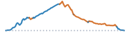

```{=html}
<script>
document.addEventListener("DOMContentLoaded", function () {
  const title = document.querySelector(".quarto-title h1.title");
  if (!title) {
    return;
  }
  title.innerHTML = title.textContent.replace(
    /(\d+% Gravel)/g,
    '<span style="color: chocolate;">$1</span>',
  );
});
</script>
```


```{=html}
<article class="mobile-route-card" data-bart="El Cerrito del Norte" data-miles="23.94" data-elevation="2666.86" data-time="178" data-road-quality="76" data-has-gravel="true">
<div class="mobile-route-heading">

<div class="mobile-route-tags"><span class="mobile-route-tag">Arlington ↑</span><span class="mobile-route-tag">Grizzly Peak ↑</span><span class="mobile-route-tag">Seaview ↓</span><span class="mobile-route-tag">Meadows Canyon ↓</span><span class="mobile-route-tag">Wildcat Creek ↓</span></div>
</div>
<div class="mobile-route-elevation" aria-hidden="true"></div>
<div class="mobile-route-metrics">
<p><span class="mobile-route-label">BART</span><br>El Cerrito del Norte</p>
<p><span class="mobile-route-label">Miles</span><br>23.94</p>
<p><span class="mobile-route-label">Elev. Gain</span><br>2666.86 ft</p>
<p><span class="mobile-route-label">Time</span><br>~3:00</p>
<p><span class="mobile-route-label">Steep Descent</span><br>1.15 mi</p>
<p><span class="mobile-route-label">Road Quality</span><br><span class="mobile-route-quality" style="background-color:#91cf60;">76%</span></p>
</div>
</article>
```
::: {.panel-tabset}

## Map

<iframe
  src="../data/routes/arlington-to-vollmer/overview_map.html"
  style="width:100%; height:min(70vh, 560px); min-height:360px; border:none;"
  loading="lazy"
  allow="fullscreen"
  webkitallowfullscreen
  mozallowfullscreen
  allowfullscreen
></iframe>

## Grade

<iframe
  src="../data/routes/arlington-to-vollmer/map.html"
  style="width:100%; height:min(70vh, 560px); min-height:360px; border:none;"
  loading="lazy"
  allow="fullscreen"
  webkitallowfullscreen
  mozallowfullscreen
  allowfullscreen
></iframe>

## Descents

<iframe
  src="../data/routes/arlington-to-vollmer/descent_chunk_map.html"
  style="width:100%; height:min(70vh, 560px); min-height:360px; border:none;"
  loading="lazy"
  allow="fullscreen"
  webkitallowfullscreen
  mozallowfullscreen
  allowfullscreen
></iframe>

```{=html}
<table class="dataframe table table-striped table-sm">
  <thead>
    <tr style="text-align: left;">
      <th>Section</th>
      <th>Average Grade</th>
      <th>Max Coast Speed</th>
      <th>Good+ Pavement</th>
      <th>Distance (mi)</th>
    </tr>
  </thead>
  <tbody>
    <tr>
      <td>TOTAL</td>
      <td>-6.7%</td>
      <td>48.6 mph</td>
      <td>18%</td>
      <td>6.8</td>
    </tr>
    <tr>
      <td>1. Arlington Boulevard: descent</td>
      <td>-5.1%</td>
      <td>33.4 mph</td>
      <td>100%</td>
      <td>0.5</td>
    </tr>
    <tr>
      <td>2. Arlington Boulevard: light descent</td>
      <td>-3.7%</td>
      <td>27.1 mph</td>
      <td>100%</td>
      <td>0.4</td>
    </tr>
    <tr>
      <td>3. Kensington Road: light descent</td>
      <td>-3.8%</td>
      <td>29.0 mph</td>
      <td>100%</td>
      <td>0.3</td>
    </tr>
    <tr>
      <td>4. Kensington Court: steep descent</td>
      <td>-8.2%</td>
      <td>44.7 mph</td>
      <td>29%</td>
      <td>0.3</td>
    </tr>
    <tr>
      <td>5. Seaview Trail: descent</td>
      <td>-8.4%</td>
      <td>38.2 mph</td>
      <td>Gravel</td>
      <td>0.8</td>
    </tr>
    <tr>
      <td>6. Seaview Trail: steep descent</td>
      <td>-9.0%</td>
      <td>46.3 mph</td>
      <td>Gravel</td>
      <td>0.7</td>
    </tr>
    <tr>
      <td>7. Meadows Canyon Trail: steep descent</td>
      <td>-7.6%</td>
      <td>46.0 mph</td>
      <td>0%</td>
      <td>1.5</td>
    </tr>
    <tr>
      <td>8. Meadows Canyon Trail: descent</td>
      <td>-7.0%</td>
      <td>37.2 mph</td>
      <td>Gravel</td>
      <td>0.5</td>
    </tr>
    <tr>
      <td>9. Loop Road: light descent</td>
      <td>-4.4%</td>
      <td>28.2 mph</td>
      <td>Gravel</td>
      <td>0.4</td>
    </tr>
    <tr>
      <td>10. Wildcat Creek Trail: light descent</td>
      <td>-3.0%</td>
      <td>26.1 mph</td>
      <td>Gravel</td>
      <td>0.2</td>
    </tr>
    <tr>
      <td>11. Wildcat Creek Trail: light descent</td>
      <td>-3.3%</td>
      <td>26.6 mph</td>
      <td>Gravel</td>
      <td>0.2</td>
    </tr>
    <tr>
      <td>12. Wildcat Creek Trail: descent</td>
      <td>-6.1%</td>
      <td>37.4 mph</td>
      <td>Gravel</td>
      <td>0.3</td>
    </tr>
    <tr>
      <td>13. Wildcat Creek Trail: steep descent</td>
      <td>-8.2%</td>
      <td>48.6 mph</td>
      <td>Gravel</td>
      <td>0.3</td>
    </tr>
    <tr>
      <td>14. Wildcat Canyon Parkway: steep descent</td>
      <td>-10.9%</td>
      <td>47.0 mph</td>
      <td>0%</td>
      <td>0.2</td>
    </tr>
    <tr>
      <td>15. Key Boulevard: light descent</td>
      <td>-2.9%</td>
      <td>25.0 mph</td>
      <td>0%</td>
      <td>0.2</td>
    </tr>
  </tbody>
</table>
```

## Ascents

<iframe
  src="../data/routes/arlington-to-vollmer/chunk_map.html"
  style="width:100%; height:min(70vh, 560px); min-height:360px; border:none;"
  loading="lazy"
  allow="fullscreen"
  webkitallowfullscreen
  mozallowfullscreen
  allowfullscreen
></iframe>

::: {.panel-tabset}

### Climbs Only

```{=html}
<table class="dataframe table table-striped table-sm">
  <thead>
    <tr style="text-align: left;">
      <th>Section (avg grade)</th>
      <th>Climb (ft)</th>
      <th>Distance (mi)</th>
      <th>Time (Min)</th>
    </tr>
  </thead>
  <tbody>
    <tr>
      <td>TOTAL</td>
      <td>2,019</td>
      <td>7.9</td>
      <td>79 ± 41</td>
    </tr>
    <tr>
      <td>1. Arlington Boulevard (4% avg)</td>
      <td>377</td>
      <td>1.7</td>
      <td>16 ± 8</td>
    </tr>
    <tr>
      <td>2. Arlington Boulevard (8% avg)</td>
      <td>361</td>
      <td>0.8</td>
      <td>12 ± 7</td>
    </tr>
    <tr>
      <td>3. Arlington Boulevard (3% avg)</td>
      <td>61</td>
      <td>0.4</td>
      <td>3 ± 1</td>
    </tr>
    <tr>
      <td>4. Terrace Drive (4% avg)</td>
      <td>83</td>
      <td>0.4</td>
      <td>4 ± 2</td>
    </tr>
    <tr>
      <td>5. Grizzly Peak Boulevard (6% avg)</td>
      <td>87</td>
      <td>0.3</td>
      <td>3 ± 2</td>
    </tr>
    <tr>
      <td>6. Grizzly Peak Boulevard (4% avg)</td>
      <td>176</td>
      <td>1.0</td>
      <td>8 ± 3</td>
    </tr>
    <tr>
      <td>7. Grizzly Peak Boulevard (4% avg)</td>
      <td>596</td>
      <td>2.5</td>
      <td>23 ± 11</td>
    </tr>
    <tr>
      <td>8. Seaview Trail (8% avg)</td>
      <td>167</td>
      <td>0.4</td>
      <td>6 ± 4</td>
    </tr>
    <tr>
      <td>9. Seaview Trail (7% avg)</td>
      <td>111</td>
      <td>0.4</td>
      <td>5 ± 3</td>
    </tr>
  </tbody>
</table>
```

### With Rest Periods

```{=html}
<table class="dataframe table table-striped table-sm">
  <thead>
    <tr style="text-align: left;">
      <th>Section (avg grade)</th>
      <th>Climb (ft)</th>
      <th>Distance (mi)</th>
      <th>Time (Min)</th>
    </tr>
  </thead>
  <tbody>
    <tr>
      <td>TOTAL</td>
      <td>2,019</td>
      <td>24.1</td>
      <td>178 ± 77</td>
    </tr>
    <tr>
      <td>flat or descent</td>
      <td></td>
      <td>2.0</td>
      <td>11</td>
    </tr>
    <tr>
      <td>1. Arlington Boulevard (4% avg)</td>
      <td>377</td>
      <td>1.7</td>
      <td>16 ± 8</td>
    </tr>
    <tr>
      <td>flat or descent</td>
      <td></td>
      <td>0.4</td>
      <td>2</td>
    </tr>
    <tr>
      <td>2. Arlington Boulevard (8% avg)</td>
      <td>361</td>
      <td>0.8</td>
      <td>12 ± 7</td>
    </tr>
    <tr>
      <td>flat or descent</td>
      <td></td>
      <td>0.5</td>
      <td>2</td>
    </tr>
    <tr>
      <td>3. Arlington Boulevard (3% avg)</td>
      <td>61</td>
      <td>0.4</td>
      <td>3 ± 1</td>
    </tr>
    <tr>
      <td>4. Terrace Drive (4% avg)</td>
      <td>83</td>
      <td>0.4</td>
      <td>4 ± 2</td>
    </tr>
    <tr>
      <td>flat or descent</td>
      <td></td>
      <td>1.4</td>
      <td>11</td>
    </tr>
    <tr>
      <td>5. Grizzly Peak Boulevard (6% avg)</td>
      <td>87</td>
      <td>0.3</td>
      <td>3 ± 2</td>
    </tr>
    <tr>
      <td>flat or descent</td>
      <td></td>
      <td>0.1</td>
      <td>1</td>
    </tr>
    <tr>
      <td>6. Grizzly Peak Boulevard (4% avg)</td>
      <td>176</td>
      <td>1.0</td>
      <td>8 ± 3</td>
    </tr>
    <tr>
      <td>flat or descent</td>
      <td></td>
      <td>0.2</td>
      <td>1</td>
    </tr>
    <tr>
      <td>7. Grizzly Peak Boulevard (4% avg)</td>
      <td>596</td>
      <td>2.5</td>
      <td>23 ± 11</td>
    </tr>
    <tr>
      <td>flat or descent</td>
      <td></td>
      <td>0.2</td>
      <td>1</td>
    </tr>
    <tr>
      <td>8. Seaview Trail (8% avg)</td>
      <td>167</td>
      <td>0.4</td>
      <td>6 ± 4</td>
    </tr>
    <tr>
      <td>flat or descent</td>
      <td></td>
      <td>0.8</td>
      <td>4</td>
    </tr>
    <tr>
      <td>9. Seaview Trail (7% avg)</td>
      <td>111</td>
      <td>0.4</td>
      <td>5 ± 3</td>
    </tr>
    <tr>
      <td>flat or descent</td>
      <td></td>
      <td>10.6</td>
      <td>66</td>
    </tr>
  </tbody>
</table>
```

:::

## Street Quality

<iframe
  src="../data/routes/arlington-to-vollmer/road_quality_map.html"
  style="width:100%; height:min(70vh, 560px); min-height:360px; border:none;"
  loading="lazy"
  allow="fullscreen"
  webkitallowfullscreen
  mozallowfullscreen
  allowfullscreen
></iframe>

```{=html}
<table class="dataframe table table-striped table-sm">
  <thead>
    <tr style="text-align: left;">
      <th>mtc_pci_info</th>
      <th>Miles</th>
      <th>Percent</th>
    </tr>
  </thead>
  <tbody>
    <tr>
      <td>Gravel</td>
      <td>10.1</td>
      <td>42.3</td>
    </tr>
    <tr>
      <td>Good</td>
      <td>5.6</td>
      <td>23.3</td>
    </tr>
    <tr>
      <td>Fair</td>
      <td>2.4</td>
      <td>10.0</td>
    </tr>
    <tr>
      <td>Poor</td>
      <td>2.4</td>
      <td>9.9</td>
    </tr>
    <tr>
      <td>Very Good</td>
      <td>1.4</td>
      <td>6.0</td>
    </tr>
    <tr>
      <td>Excellent</td>
      <td>1.1</td>
      <td>4.7</td>
    </tr>
    <tr>
      <td>At Risk</td>
      <td>0.4</td>
      <td>1.8</td>
    </tr>
    <tr>
      <td>Unknown</td>
      <td>0.5</td>
      <td>2.0</td>
    </tr>
  </tbody>
</table>
```

:::
