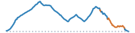

```{=html}
<script>
document.addEventListener("DOMContentLoaded", function () {
  const title = document.querySelector(".quarto-title h1.title");
  if (!title) {
    return;
  }
  title.innerHTML = title.textContent.replace(
    /(\d+% Gravel)/g,
    '<span style="color: chocolate;">$1</span>',
  );
});
</script>
```


```{=html}
<article class="mobile-route-card" data-bart="MacArthur" data-miles="27.15" data-elevation="2589.41" data-time="186" data-road-quality="72" data-has-gravel="true">
<div class="mobile-route-heading">

<div class="mobile-route-tags"><span class="mobile-route-tag">Tunnel ↑</span><span class="mobile-route-tag">Pinehurst ↓</span><span class="mobile-route-tag">Goldenrod Trail ↓</span></div>
</div>
<div class="mobile-route-elevation" aria-hidden="true"></div>
<div class="mobile-route-metrics">
<p><span class="mobile-route-label">BART</span><br>MacArthur</p>
<p><span class="mobile-route-label">Miles</span><br>27.15</p>
<p><span class="mobile-route-label">Elev. Gain</span><br>2589.41 ft</p>
<p><span class="mobile-route-label">Time</span><br>~3:10</p>
<p><span class="mobile-route-label">Steep Descent</span><br>0.63 mi</p>
<p><span class="mobile-route-label">Road Quality</span><br><span class="mobile-route-quality" style="background-color:#91cf60;">72%</span></p>
</div>
</article>
```
::: {.panel-tabset}

## Map

<iframe
  src="../data/routes/bbr-skyline-chabot/overview_map.html"
  style="width:100%; height:min(70vh, 560px); min-height:360px; border:none;"
  loading="lazy"
  allow="fullscreen"
  webkitallowfullscreen
  mozallowfullscreen
  allowfullscreen
></iframe>

## Hazards

<iframe
  src="../data/routes/bbr-skyline-chabot/map.html"
  style="width:100%; height:min(70vh, 560px); min-height:360px; border:none;"
  loading="lazy"
  allow="fullscreen"
  webkitallowfullscreen
  mozallowfullscreen
  allowfullscreen
></iframe>

```{=html}
<table class="dataframe table table-striped table-sm">
  <thead>
    <tr style="text-align: left;">
      <th>Hazard</th>
      <th>Distance (mi)</th>
      <th>Percent</th>
    </tr>
  </thead>
  <tbody>
    <tr>
      <td>Flat</td>
      <td>14.03</td>
      <td>52.0</td>
    </tr>
    <tr>
      <td>Climb</td>
      <td>3.75</td>
      <td>14.0</td>
    </tr>
    <tr>
      <td>Descent</td>
      <td>3.38</td>
      <td>12.0</td>
    </tr>
    <tr>
      <td>Light Descent</td>
      <td>3.09</td>
      <td>11.0</td>
    </tr>
    <tr>
      <td>Steep Climb</td>
      <td>2.28</td>
      <td>8.0</td>
    </tr>
    <tr>
      <td>Steep Descent</td>
      <td>0.63</td>
      <td>2.0</td>
    </tr>
  </tbody>
</table>
```

## Climbs

<iframe
  src="../data/routes/bbr-skyline-chabot/chunk_map.html"
  style="width:100%; height:min(70vh, 560px); min-height:360px; border:none;"
  loading="lazy"
  allow="fullscreen"
  webkitallowfullscreen
  mozallowfullscreen
  allowfullscreen
></iframe>

::: {.panel-tabset}

### Climbs Only

```{=html}
<table class="dataframe table table-striped table-sm">
  <thead>
    <tr style="text-align: left;">
      <th>Section (avg grade)</th>
      <th>Climb (ft)</th>
      <th>Distance (mi)</th>
      <th>Time (Min)</th>
    </tr>
  </thead>
  <tbody>
    <tr>
      <td>TOTAL</td>
      <td>2,170</td>
      <td>9.6</td>
      <td>88 ± 42</td>
    </tr>
    <tr>
      <td>1. Broadway (5% avg)</td>
      <td>264</td>
      <td>1.1</td>
      <td>11 ± 5</td>
    </tr>
    <tr>
      <td>2. Broadway (10% avg)</td>
      <td>105</td>
      <td>0.3</td>
      <td>3 ± 2</td>
    </tr>
    <tr>
      <td>3. Tunnel Road (4% avg)</td>
      <td>808</td>
      <td>3.4</td>
      <td>33 ± 17</td>
    </tr>
    <tr>
      <td>4. Pinehurst Road (4% avg)</td>
      <td>320</td>
      <td>1.4</td>
      <td>14 ± 7</td>
    </tr>
    <tr>
      <td>5. Redwood Road (4% avg)</td>
      <td>595</td>
      <td>3.0</td>
      <td>25 ± 10</td>
    </tr>
    <tr>
      <td>6. Skyline Boulevard (4% avg)</td>
      <td>78</td>
      <td>0.4</td>
      <td>3 ± 1</td>
    </tr>
  </tbody>
</table>
```

### With Rest Periods

```{=html}
<table class="dataframe table table-striped table-sm">
  <thead>
    <tr style="text-align: left;">
      <th>Section (avg grade)</th>
      <th>Climb (ft)</th>
      <th>Distance (mi)</th>
      <th>Time (Min)</th>
    </tr>
  </thead>
  <tbody>
    <tr>
      <td>TOTAL</td>
      <td>2,170</td>
      <td>27.0</td>
      <td>186 ± 73</td>
    </tr>
    <tr>
      <td>flat or descent</td>
      <td></td>
      <td>1.8</td>
      <td>10</td>
    </tr>
    <tr>
      <td>1. Broadway (5% avg)</td>
      <td>264</td>
      <td>1.1</td>
      <td>11 ± 5</td>
    </tr>
    <tr>
      <td>flat or descent</td>
      <td></td>
      <td>0.1</td>
      <td>1</td>
    </tr>
    <tr>
      <td>2. Broadway (10% avg)</td>
      <td>105</td>
      <td>0.3</td>
      <td>3 ± 2</td>
    </tr>
    <tr>
      <td>flat or descent</td>
      <td></td>
      <td>0.1</td>
      <td>1</td>
    </tr>
    <tr>
      <td>3. Tunnel Road (4% avg)</td>
      <td>808</td>
      <td>3.4</td>
      <td>33 ± 17</td>
    </tr>
    <tr>
      <td>flat or descent</td>
      <td></td>
      <td>5.6</td>
      <td>30</td>
    </tr>
    <tr>
      <td>4. Pinehurst Road (4% avg)</td>
      <td>320</td>
      <td>1.4</td>
      <td>14 ± 7</td>
    </tr>
    <tr>
      <td>flat or descent</td>
      <td></td>
      <td>1.1</td>
      <td>5</td>
    </tr>
    <tr>
      <td>5. Redwood Road (4% avg)</td>
      <td>595</td>
      <td>3.0</td>
      <td>25 ± 10</td>
    </tr>
    <tr>
      <td>flat or descent</td>
      <td></td>
      <td>0.3</td>
      <td>2</td>
    </tr>
    <tr>
      <td>6. Skyline Boulevard (4% avg)</td>
      <td>78</td>
      <td>0.4</td>
      <td>3 ± 1</td>
    </tr>
    <tr>
      <td>flat or descent</td>
      <td></td>
      <td>8.4</td>
      <td>50</td>
    </tr>
  </tbody>
</table>
```

:::

## Street Quality

<iframe
  src="../data/routes/bbr-skyline-chabot/road_quality_map.html"
  style="width:100%; height:min(70vh, 560px); min-height:360px; border:none;"
  loading="lazy"
  allow="fullscreen"
  webkitallowfullscreen
  mozallowfullscreen
  allowfullscreen
></iframe>

```{=html}
<table class="dataframe table table-striped table-sm">
  <thead>
    <tr style="text-align: left;">
      <th>mtc_pci_info</th>
      <th>Miles</th>
      <th>Percent</th>
    </tr>
  </thead>
  <tbody>
    <tr>
      <td>Good</td>
      <td>6.3</td>
      <td>23.3</td>
    </tr>
    <tr>
      <td>Very Good</td>
      <td>5.7</td>
      <td>21.0</td>
    </tr>
    <tr>
      <td>Fair</td>
      <td>4.4</td>
      <td>16.1</td>
    </tr>
    <tr>
      <td>Poor</td>
      <td>3.8</td>
      <td>14.0</td>
    </tr>
    <tr>
      <td>Gravel</td>
      <td>3.6</td>
      <td>13.1</td>
    </tr>
    <tr>
      <td>At Risk</td>
      <td>1.6</td>
      <td>5.8</td>
    </tr>
    <tr>
      <td>Failed</td>
      <td>0.9</td>
      <td>3.4</td>
    </tr>
    <tr>
      <td>Excellent</td>
      <td>0.5</td>
      <td>1.9</td>
    </tr>
    <tr>
      <td>Cycleway</td>
      <td>0.1</td>
      <td>0.3</td>
    </tr>
    <tr>
      <td>Unknown</td>
      <td>0.3</td>
      <td>1.1</td>
    </tr>
  </tbody>
</table>
```

:::
