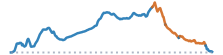

```{=html}
<article class="mobile-route-card" data-bart="San Leandro" data-miles="38.61" data-elevation="5624.67" data-time="271" data-has-gravel="true">

<div class="mobile-route-elevation" aria-hidden="true"></div>
<div class="mobile-route-metrics">
<p><span class="mobile-route-label">BART</span><br>San Leandro</p>
<p><span class="mobile-route-label">Miles</span><br>38.61</p>
<p><span class="mobile-route-label">Elevation Gain</span><br>5624.67 ft</p>
<p><span class="mobile-route-label">Time</span><br>~4:31</p>
<p><span class="mobile-route-label">Steep Descent</span><br>0.88 mi</p>
<p><span class="mobile-route-label">Road Quality</span><br><span class="mobile-route-quality" style="background-color:#91cf60;">76%</span></p>
</div>
</article>
```
::: {.panel-tabset}

## Hazards

<iframe
  src="../data/routes/big-redwood-to-tilden/map.html"
  style="width:100%; height:min(70vh, 560px); min-height:360px; border:none;"
  loading="lazy"
  allowfullscreen
></iframe>

```{=html}
<table class="dataframe table table-striped table-sm">
  <thead>
    <tr style="text-align: left;">
      <th>Hazard</th>
      <th>Distance (mi)</th>
      <th>Percent</th>
    </tr>
  </thead>
  <tbody>
    <tr>
      <td>Flat</td>
      <td>20.71</td>
      <td>54.0</td>
    </tr>
    <tr>
      <td>Climb</td>
      <td>6.02</td>
      <td>16.0</td>
    </tr>
    <tr>
      <td>Light Descent</td>
      <td>4.16</td>
      <td>11.0</td>
    </tr>
    <tr>
      <td>Descent</td>
      <td>3.47</td>
      <td>9.0</td>
    </tr>
    <tr>
      <td>Steep Climb</td>
      <td>3.38</td>
      <td>9.0</td>
    </tr>
    <tr>
      <td>Steep Descent</td>
      <td>0.88</td>
      <td>2.0</td>
    </tr>
  </tbody>
</table>
```

## Climbs

<iframe
  src="../data/routes/big-redwood-to-tilden/chunk_map.html"
  style="width:100%; height:min(70vh, 560px); min-height:360px; border:none;"
  loading="lazy"
  allowfullscreen
></iframe>

### Climbs Only

```{=html}
<table class="dataframe table table-striped table-sm">
  <thead>
    <tr style="text-align: left;">
      <th>Section (avg grade)</th>
      <th>Climb (ft)</th>
      <th>Distance (mi)</th>
      <th>Time (Min)</th>
    </tr>
  </thead>
  <tbody>
    <tr>
      <td>TOTAL</td>
      <td>3,254</td>
      <td>11.6</td>
      <td>112 ± 54</td>
    </tr>
    <tr>
      <td>1. Lake Chabot Road (7% avg)</td>
      <td>250</td>
      <td>0.7</td>
      <td>8 ± 4</td>
    </tr>
    <tr>
      <td>2. Walnut Road (5% avg)</td>
      <td>314</td>
      <td>1.2</td>
      <td>12 ± 6</td>
    </tr>
    <tr>
      <td>3. Redwood Road (5% avg)</td>
      <td>636</td>
      <td>2.3</td>
      <td>22 ± 10</td>
    </tr>
    <tr>
      <td>4. Redwood Road (4% avg)</td>
      <td>640</td>
      <td>2.8</td>
      <td>24 ± 10</td>
    </tr>
    <tr>
      <td>5. Skyline Boulevard (6% avg)</td>
      <td>344</td>
      <td>1.0</td>
      <td>11 ± 6</td>
    </tr>
    <tr>
      <td>6. Skyline Boulevard (3% avg)</td>
      <td>257</td>
      <td>1.2</td>
      <td>10 ± 5</td>
    </tr>
    <tr>
      <td>7. Grizzly Peak Boulevard (6% avg)</td>
      <td>563</td>
      <td>1.6</td>
      <td>17 ± 9</td>
    </tr>
    <tr>
      <td>8. Seaview Trail (7% avg)</td>
      <td>147</td>
      <td>0.4</td>
      <td>5 ± 3</td>
    </tr>
    <tr>
      <td>9. Lone Oak Drive (1% avg)</td>
      <td>101</td>
      <td>0.4</td>
      <td>3 ± 2</td>
    </tr>
  </tbody>
</table>
```

### With Rest Periods

```{=html}
<table class="dataframe table table-striped table-sm">
  <thead>
    <tr style="text-align: left;">
      <th>Section (avg grade)</th>
      <th>Climb (ft)</th>
      <th>Distance (mi)</th>
      <th>Time (Min)</th>
    </tr>
  </thead>
  <tbody>
    <tr>
      <td>TOTAL</td>
      <td>3,254</td>
      <td>38.7</td>
      <td>271 ± 108</td>
    </tr>
    <tr>
      <td>flat or descent</td>
      <td></td>
      <td>1.6</td>
      <td>9</td>
    </tr>
    <tr>
      <td>1. Lake Chabot Road (7% avg)</td>
      <td>250</td>
      <td>0.7</td>
      <td>8 ± 4</td>
    </tr>
    <tr>
      <td>flat or descent</td>
      <td></td>
      <td>2.5</td>
      <td>14</td>
    </tr>
    <tr>
      <td>2. Walnut Road (5% avg)</td>
      <td>314</td>
      <td>1.2</td>
      <td>12 ± 6</td>
    </tr>
    <tr>
      <td>flat or descent</td>
      <td></td>
      <td>2.2</td>
      <td>11</td>
    </tr>
    <tr>
      <td>3. Redwood Road (5% avg)</td>
      <td>636</td>
      <td>2.3</td>
      <td>22 ± 10</td>
    </tr>
    <tr>
      <td>flat or descent</td>
      <td></td>
      <td>4.2</td>
      <td>24</td>
    </tr>
    <tr>
      <td>4. Redwood Road (4% avg)</td>
      <td>640</td>
      <td>2.8</td>
      <td>24 ± 10</td>
    </tr>
    <tr>
      <td>flat or descent</td>
      <td></td>
      <td>0.2</td>
      <td>1</td>
    </tr>
    <tr>
      <td>5. Skyline Boulevard (6% avg)</td>
      <td>344</td>
      <td>1.0</td>
      <td>11 ± 6</td>
    </tr>
    <tr>
      <td>flat or descent</td>
      <td></td>
      <td>3.4</td>
      <td>21</td>
    </tr>
    <tr>
      <td>6. Skyline Boulevard (3% avg)</td>
      <td>257</td>
      <td>1.2</td>
      <td>10 ± 5</td>
    </tr>
    <tr>
      <td>flat or descent</td>
      <td></td>
      <td>2.0</td>
      <td>12</td>
    </tr>
    <tr>
      <td>7. Grizzly Peak Boulevard (6% avg)</td>
      <td>563</td>
      <td>1.6</td>
      <td>17 ± 9</td>
    </tr>
    <tr>
      <td>flat or descent</td>
      <td></td>
      <td>0.8</td>
      <td>4</td>
    </tr>
    <tr>
      <td>8. Seaview Trail (7% avg)</td>
      <td>147</td>
      <td>0.4</td>
      <td>5 ± 3</td>
    </tr>
    <tr>
      <td>flat or descent</td>
      <td></td>
      <td>2.7</td>
      <td>14</td>
    </tr>
    <tr>
      <td>9. Lone Oak Drive (1% avg)</td>
      <td>101</td>
      <td>0.4</td>
      <td>3 ± 2</td>
    </tr>
    <tr>
      <td>flat or descent</td>
      <td></td>
      <td>7.5</td>
      <td>49</td>
    </tr>
  </tbody>
</table>
```

## Street Quality

<iframe
  src="../data/routes/big-redwood-to-tilden/road_quality_map.html"
  style="width:100%; height:min(70vh, 560px); min-height:360px; border:none;"
  loading="lazy"
  allowfullscreen
></iframe>

```{=html}
<table class="dataframe table table-striped table-sm">
  <thead>
    <tr style="text-align: left;">
      <th>mtc_pci_info</th>
      <th>Miles</th>
      <th>Percent</th>
    </tr>
  </thead>
  <tbody>
    <tr>
      <td>Good</td>
      <td>15.5</td>
      <td>40.2</td>
    </tr>
    <tr>
      <td>Gravel</td>
      <td>9.3</td>
      <td>24.0</td>
    </tr>
    <tr>
      <td>Poor</td>
      <td>5.3</td>
      <td>13.8</td>
    </tr>
    <tr>
      <td>Very Good</td>
      <td>4.6</td>
      <td>11.8</td>
    </tr>
    <tr>
      <td>Excellent</td>
      <td>1.4</td>
      <td>3.7</td>
    </tr>
    <tr>
      <td>At Risk</td>
      <td>0.8</td>
      <td>2.2</td>
    </tr>
    <tr>
      <td>Fair</td>
      <td>0.8</td>
      <td>2.0</td>
    </tr>
    <tr>
      <td>Failed</td>
      <td>0.1</td>
      <td>0.2</td>
    </tr>
    <tr>
      <td>Cycleway</td>
      <td>0.0</td>
      <td>0.1</td>
    </tr>
    <tr>
      <td>Unknown</td>
      <td>0.8</td>
      <td>2.1</td>
    </tr>
  </tbody>
</table>
```

:::
