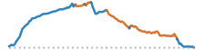

```{=html}
<script>
document.addEventListener("DOMContentLoaded", function () {
  const title = document.querySelector(".quarto-title h1.title");
  if (!title) {
    return;
  }
  title.innerHTML = title.textContent.replace(
    /(\d+% Gravel)/g,
    '<span style="color: chocolate;">$1</span>',
  );
});
</script>
```


```{=html}
<article class="mobile-route-card" data-bart="North Berkeley" data-miles="18.78" data-elevation="1661.29" data-time="134" data-road-quality="69" data-has-gravel="true">
<div class="mobile-route-heading">

<div class="mobile-route-tags"><span class="mobile-route-tag">Spruce ↑</span><span class="mobile-route-tag">Golf Course Trail</span><span class="mobile-route-tag">Meadows Canyon ↓</span><span class="mobile-route-tag">Wildcat Creek ↓</span></div>
</div>
<div class="mobile-route-elevation" aria-hidden="true"></div>
<div class="mobile-route-metrics">
<p><span class="mobile-route-label">BART</span><br>North Berkeley</p>
<p><span class="mobile-route-label">Miles</span><br>18.78</p>
<p><span class="mobile-route-label">Elev. Gain</span><br>1661.29 ft</p>
<p><span class="mobile-route-label">Time</span><br>~2:10</p>
<p><span class="mobile-route-label">Danger Zone</span><br>0.50 mi</p>
<p><span class="mobile-route-label">Road Quality</span><br><span class="mobile-route-quality" style="background-color:#d9ef8b;">69%</span></p>
</div>
</article>
```
::: {.panel-tabset}

## Map

<iframe
  src="../data/routes/intro-to-tilden-gravel/overview_map.html"
  style="width:100%; height:min(70vh, 560px); min-height:360px; border:none;"
  loading="lazy"
  allow="fullscreen"
  webkitallowfullscreen
  mozallowfullscreen
  allowfullscreen
></iframe>

## Grade

<iframe
  src="../data/routes/intro-to-tilden-gravel/map.html"
  style="width:100%; height:min(70vh, 560px); min-height:360px; border:none;"
  loading="lazy"
  allow="fullscreen"
  webkitallowfullscreen
  mozallowfullscreen
  allowfullscreen
></iframe>

## Descents

<iframe
  src="../data/routes/intro-to-tilden-gravel/descent_chunk_map.html"
  style="width:100%; height:min(70vh, 560px); min-height:360px; border:none;"
  loading="lazy"
  allow="fullscreen"
  webkitallowfullscreen
  mozallowfullscreen
  allowfullscreen
></iframe>

Note that maximum speeds are based on a physical model of a rider, subjected to an assumed weight and rolling resistance, coasting down the entire descent without applying the brakes.  

::: {.panel-tabset}

### Danger Zone

"Danger Zone" descents are those where maximum modeled coasting speed reaches above 50mph on any road, or else above 40mph on gravel roads, or those with low-quality pavement (<50% passing).  

```{=html}
<table class="dataframe table table-striped table-sm">
  <thead>
    <tr style="text-align: left;">
      <th>Section</th>
      <th>Average Grade</th>
      <th>Max Coast Speed</th>
      <th>Good+ Pavement</th>
      <th>Distance (mi)</th>
    </tr>
  </thead>
  <tbody>
    <tr>
      <td>10. Wildcat Creek Trail: steep descent</td>
      <td>-8.2%</td>
      <td>48.6 mph</td>
      <td>Gravel</td>
      <td>0.3</td>
    </tr>
    <tr>
      <td>11. Wildcat Canyon Parkway: steep descent</td>
      <td>-10.9%</td>
      <td>47.0 mph</td>
      <td>0%</td>
      <td>0.2</td>
    </tr>
  </tbody>
</table>
```

### All Descents

```{=html}
<table class="dataframe table table-striped table-sm">
  <thead>
    <tr style="text-align: left;">
      <th>Section</th>
      <th>Average Grade</th>
      <th>Max Coast Speed</th>
      <th>Good+ Pavement</th>
      <th>Distance (mi)</th>
    </tr>
  </thead>
  <tbody>
    <tr>
      <td>TOTAL</td>
      <td>-5.8%</td>
      <td>48.6 mph</td>
      <td>Gravel</td>
      <td>4.9</td>
    </tr>
    <tr>
      <td>1. Golf Course Drive: light descent</td>
      <td>-6.3%</td>
      <td>30.8 mph</td>
      <td>0%</td>
      <td>0.3</td>
    </tr>
    <tr>
      <td>2. Golf Course Trail: descent</td>
      <td>-5.0%</td>
      <td>37.2 mph</td>
      <td>Gravel</td>
      <td>0.2</td>
    </tr>
    <tr>
      <td>3. South Park Drive: descent</td>
      <td>-6.9%</td>
      <td>40.2 mph</td>
      <td>7%</td>
      <td>0.8</td>
    </tr>
    <tr>
      <td>4. Meadows Canyon Trail: descent</td>
      <td>-5.3%</td>
      <td>36.5 mph</td>
      <td>Gravel</td>
      <td>1.1</td>
    </tr>
    <tr>
      <td>5. Meadows Canyon Trail: descent</td>
      <td>-7.0%</td>
      <td>37.2 mph</td>
      <td>Gravel</td>
      <td>0.5</td>
    </tr>
    <tr>
      <td>6. Loop Road: light descent</td>
      <td>-4.4%</td>
      <td>28.2 mph</td>
      <td>Gravel</td>
      <td>0.4</td>
    </tr>
    <tr>
      <td>7. Wildcat Creek Trail: light descent</td>
      <td>-3.0%</td>
      <td>26.1 mph</td>
      <td>Gravel</td>
      <td>0.2</td>
    </tr>
    <tr>
      <td>8. Wildcat Creek Trail: light descent</td>
      <td>-3.3%</td>
      <td>26.6 mph</td>
      <td>Gravel</td>
      <td>0.2</td>
    </tr>
    <tr>
      <td>9. Wildcat Creek Trail: descent</td>
      <td>-6.1%</td>
      <td>37.4 mph</td>
      <td>Gravel</td>
      <td>0.3</td>
    </tr>
    <tr>
      <td>10. Wildcat Creek Trail: steep descent</td>
      <td>-8.2%</td>
      <td>48.6 mph</td>
      <td>Gravel</td>
      <td>0.3</td>
    </tr>
    <tr>
      <td>11. Wildcat Canyon Parkway: steep descent</td>
      <td>-10.9%</td>
      <td>47.0 mph</td>
      <td>0%</td>
      <td>0.2</td>
    </tr>
    <tr>
      <td>12. Key Boulevard: light descent</td>
      <td>-2.8%</td>
      <td>23.6 mph</td>
      <td>6%</td>
      <td>0.3</td>
    </tr>
  </tbody>
</table>
```

:::

## Ascents

<iframe
  src="../data/routes/intro-to-tilden-gravel/chunk_map.html"
  style="width:100%; height:min(70vh, 560px); min-height:360px; border:none;"
  loading="lazy"
  allow="fullscreen"
  webkitallowfullscreen
  mozallowfullscreen
  allowfullscreen
></iframe>

::: {.panel-tabset}

### Climbs Only

```{=html}
<table class="dataframe table table-striped table-sm">
  <thead>
    <tr style="text-align: left;">
      <th>Section (avg grade)</th>
      <th>Climb (ft)</th>
      <th>Distance (mi)</th>
      <th>Time (Min)</th>
    </tr>
  </thead>
  <tbody>
    <tr>
      <td>TOTAL</td>
      <td>1,305</td>
      <td>6.1</td>
      <td>58 ± 27</td>
    </tr>
    <tr>
      <td>1. Grizzly Peak Boulevard (5% avg)</td>
      <td>953</td>
      <td>4.0</td>
      <td>38 ± 18</td>
    </tr>
    <tr>
      <td>2. Golf Course Drive (6% avg)</td>
      <td>102</td>
      <td>0.3</td>
      <td>4 ± 2</td>
    </tr>
    <tr>
      <td>3. Golf Course Trail (2% avg)</td>
      <td>162</td>
      <td>1.1</td>
      <td>10 ± 5</td>
    </tr>
    <tr>
      <td>4. Wildcat Canyon Road (3% avg)</td>
      <td>36</td>
      <td>0.3</td>
      <td>2 ± 1</td>
    </tr>
    <tr>
      <td>5. Meadows Canyon Trail (1% avg)</td>
      <td>52</td>
      <td>0.4</td>
      <td>3 ± 2</td>
    </tr>
  </tbody>
</table>
```

### With Rest Periods

```{=html}
<table class="dataframe table table-striped table-sm">
  <thead>
    <tr style="text-align: left;">
      <th>Section (avg grade)</th>
      <th>Climb (ft)</th>
      <th>Distance (mi)</th>
      <th>Time (Min)</th>
    </tr>
  </thead>
  <tbody>
    <tr>
      <td>TOTAL</td>
      <td>1,305</td>
      <td>18.8</td>
      <td>134 ± 54</td>
    </tr>
    <tr>
      <td>flat or descent</td>
      <td></td>
      <td>0.9</td>
      <td>4</td>
    </tr>
    <tr>
      <td>1. Grizzly Peak Boulevard (5% avg)</td>
      <td>953</td>
      <td>4.0</td>
      <td>38 ± 18</td>
    </tr>
    <tr>
      <td>2. Golf Course Drive (6% avg)</td>
      <td>102</td>
      <td>0.3</td>
      <td>4 ± 2</td>
    </tr>
    <tr>
      <td>flat or descent</td>
      <td></td>
      <td>0.3</td>
      <td>2</td>
    </tr>
    <tr>
      <td>3. Golf Course Trail (2% avg)</td>
      <td>162</td>
      <td>1.1</td>
      <td>10 ± 5</td>
    </tr>
    <tr>
      <td>flat or descent</td>
      <td></td>
      <td>1.3</td>
      <td>8</td>
    </tr>
    <tr>
      <td>4. Wildcat Canyon Road (3% avg)</td>
      <td>36</td>
      <td>0.3</td>
      <td>2 ± 1</td>
    </tr>
    <tr>
      <td>flat or descent</td>
      <td></td>
      <td>1.8</td>
      <td>9</td>
    </tr>
    <tr>
      <td>5. Meadows Canyon Trail (1% avg)</td>
      <td>52</td>
      <td>0.4</td>
      <td>3 ± 2</td>
    </tr>
    <tr>
      <td>flat or descent</td>
      <td></td>
      <td>8.4</td>
      <td>54</td>
    </tr>
  </tbody>
</table>
```

:::

## Street Quality

<iframe
  src="../data/routes/intro-to-tilden-gravel/road_quality_map.html"
  style="width:100%; height:min(70vh, 560px); min-height:360px; border:none;"
  loading="lazy"
  allow="fullscreen"
  webkitallowfullscreen
  mozallowfullscreen
  allowfullscreen
></iframe>

```{=html}
<table class="dataframe table table-striped table-sm">
  <thead>
    <tr style="text-align: left;">
      <th>mtc_pci_info</th>
      <th>Miles</th>
      <th>Percent</th>
    </tr>
  </thead>
  <tbody>
    <tr>
      <td>Gravel</td>
      <td>7.5</td>
      <td>39.8</td>
    </tr>
    <tr>
      <td>Good</td>
      <td>2.8</td>
      <td>15.0</td>
    </tr>
    <tr>
      <td>Excellent</td>
      <td>2.2</td>
      <td>11.5</td>
    </tr>
    <tr>
      <td>Fair</td>
      <td>1.6</td>
      <td>8.3</td>
    </tr>
    <tr>
      <td>Very Good</td>
      <td>1.2</td>
      <td>6.5</td>
    </tr>
    <tr>
      <td>Poor</td>
      <td>1.0</td>
      <td>5.6</td>
    </tr>
    <tr>
      <td>At Risk</td>
      <td>0.5</td>
      <td>2.5</td>
    </tr>
    <tr>
      <td>Failed</td>
      <td>0.2</td>
      <td>1.1</td>
    </tr>
    <tr>
      <td>Cycleway</td>
      <td>0.0</td>
      <td>0.2</td>
    </tr>
    <tr>
      <td>Unknown</td>
      <td>1.8</td>
      <td>9.5</td>
    </tr>
  </tbody>
</table>
```

:::
