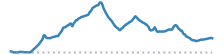

```{=html}
<script>
document.addEventListener("DOMContentLoaded", function () {
  const title = document.querySelector(".quarto-title h1.title");
  if (!title) {
    return;
  }
  title.innerHTML = title.textContent.replace(
    /(\d+% Gravel)/g,
    '<span style="color: chocolate;">$1</span>',
  );
});
</script>
```


```{=html}
<article class="mobile-route-card" data-bart="Lake Merritt" data-miles="23.70" data-elevation="1905.44" data-time="158" data-road-quality="54" data-has-gravel="false">
<div class="mobile-route-heading">

<div class="mobile-route-tags"><span class="mobile-route-tag">Wildwood+Leimert ↑</span><span class="mobile-route-tag">Butters Canyon ↑</span><span class="mobile-route-tag">La-Moraga Trail</span></div>
</div>
<div class="mobile-route-elevation" aria-hidden="true"></div>
<div class="mobile-route-metrics">
<p><span class="mobile-route-label">BART</span><br>Lake Merritt</p>
<p><span class="mobile-route-label">Miles</span><br>23.7</p>
<p><span class="mobile-route-label">Elev. Gain</span><br>1905.44 ft</p>
<p><span class="mobile-route-label">Time</span><br>~2:40</p>
<p><span class="mobile-route-label">Steep Descent</span><br>0.19 mi</p>
<p><span class="mobile-route-label">Road Quality</span><br><span class="mobile-route-quality" style="background-color:#ffffbf;">54%</span></p>
</div>
</article>
```
::: {.panel-tabset}

## Map

<iframe
  src="../data/routes/merrit-to-lamorinda/overview_map.html"
  style="width:100%; height:min(70vh, 560px); min-height:360px; border:none;"
  loading="lazy"
  allow="fullscreen"
  webkitallowfullscreen
  mozallowfullscreen
  allowfullscreen
></iframe>

## Hazards

<iframe
  src="../data/routes/merrit-to-lamorinda/map.html"
  style="width:100%; height:min(70vh, 560px); min-height:360px; border:none;"
  loading="lazy"
  allow="fullscreen"
  webkitallowfullscreen
  mozallowfullscreen
  allowfullscreen
></iframe>

```{=html}
<table class="dataframe table table-striped table-sm">
  <thead>
    <tr style="text-align: left;">
      <th>Hazard</th>
      <th>Distance (mi)</th>
      <th>Percent</th>
    </tr>
  </thead>
  <tbody>
    <tr>
      <td>Flat</td>
      <td>13.88</td>
      <td>59.0</td>
    </tr>
    <tr>
      <td>Light Descent</td>
      <td>3.68</td>
      <td>16.0</td>
    </tr>
    <tr>
      <td>Climb</td>
      <td>3.24</td>
      <td>14.0</td>
    </tr>
    <tr>
      <td>Steep Climb</td>
      <td>1.49</td>
      <td>6.0</td>
    </tr>
    <tr>
      <td>Descent</td>
      <td>1.22</td>
      <td>5.0</td>
    </tr>
    <tr>
      <td>Steep Descent</td>
      <td>0.19</td>
      <td>1.0</td>
    </tr>
  </tbody>
</table>
```

## Climbs

<iframe
  src="../data/routes/merrit-to-lamorinda/chunk_map.html"
  style="width:100%; height:min(70vh, 560px); min-height:360px; border:none;"
  loading="lazy"
  allow="fullscreen"
  webkitallowfullscreen
  mozallowfullscreen
  allowfullscreen
></iframe>

::: {.panel-tabset}

### Climbs Only

```{=html}
<table class="dataframe table table-striped table-sm">
  <thead>
    <tr style="text-align: left;">
      <th>Section (avg grade)</th>
      <th>Climb (ft)</th>
      <th>Distance (mi)</th>
      <th>Time (Min)</th>
    </tr>
  </thead>
  <tbody>
    <tr>
      <td>TOTAL</td>
      <td>1,659</td>
      <td>8.1</td>
      <td>74 ± 35</td>
    </tr>
    <tr>
      <td>1. Wildwood Avenue (3% avg)</td>
      <td>379</td>
      <td>1.8</td>
      <td>16 ± 7</td>
    </tr>
    <tr>
      <td>2. Leimert Boulevard (5% avg)</td>
      <td>275</td>
      <td>1.0</td>
      <td>11 ± 6</td>
    </tr>
    <tr>
      <td>3. Butters Drive (4% avg)</td>
      <td>534</td>
      <td>2.7</td>
      <td>25 ± 12</td>
    </tr>
    <tr>
      <td>4. Pinehurst Road (4% avg)</td>
      <td>302</td>
      <td>1.3</td>
      <td>13 ± 7</td>
    </tr>
    <tr>
      <td>5. Canyon Road (2% avg)</td>
      <td>82</td>
      <td>0.7</td>
      <td>5 ± 2</td>
    </tr>
    <tr>
      <td>6. Lafayette-Moraga Trail (4% avg)</td>
      <td>89</td>
      <td>0.6</td>
      <td>4 ± 2</td>
    </tr>
  </tbody>
</table>
```

### With Rest Periods

```{=html}
<table class="dataframe table table-striped table-sm">
  <thead>
    <tr style="text-align: left;">
      <th>Section (avg grade)</th>
      <th>Climb (ft)</th>
      <th>Distance (mi)</th>
      <th>Time (Min)</th>
    </tr>
  </thead>
  <tbody>
    <tr>
      <td>TOTAL</td>
      <td>1,659</td>
      <td>23.6</td>
      <td>158 ± 59</td>
    </tr>
    <tr>
      <td>flat or descent</td>
      <td></td>
      <td>2.8</td>
      <td>15</td>
    </tr>
    <tr>
      <td>1. Wildwood Avenue (3% avg)</td>
      <td>379</td>
      <td>1.8</td>
      <td>16 ± 7</td>
    </tr>
    <tr>
      <td>flat or descent</td>
      <td></td>
      <td>0.9</td>
      <td>6</td>
    </tr>
    <tr>
      <td>2. Leimert Boulevard (5% avg)</td>
      <td>275</td>
      <td>1.0</td>
      <td>11 ± 6</td>
    </tr>
    <tr>
      <td>flat or descent</td>
      <td></td>
      <td>0.3</td>
      <td>2</td>
    </tr>
    <tr>
      <td>3. Butters Drive (4% avg)</td>
      <td>534</td>
      <td>2.7</td>
      <td>25 ± 12</td>
    </tr>
    <tr>
      <td>flat or descent</td>
      <td></td>
      <td>3.1</td>
      <td>16</td>
    </tr>
    <tr>
      <td>4. Pinehurst Road (4% avg)</td>
      <td>302</td>
      <td>1.3</td>
      <td>13 ± 7</td>
    </tr>
    <tr>
      <td>flat or descent</td>
      <td></td>
      <td>1.2</td>
      <td>6</td>
    </tr>
    <tr>
      <td>5. Canyon Road (2% avg)</td>
      <td>82</td>
      <td>0.7</td>
      <td>5 ± 2</td>
    </tr>
    <tr>
      <td>flat or descent</td>
      <td></td>
      <td>2.2</td>
      <td>12</td>
    </tr>
    <tr>
      <td>6. Lafayette-Moraga Trail (4% avg)</td>
      <td>89</td>
      <td>0.6</td>
      <td>4 ± 2</td>
    </tr>
    <tr>
      <td>flat or descent</td>
      <td></td>
      <td>5.0</td>
      <td>27</td>
    </tr>
  </tbody>
</table>
```

:::

## Street Quality

<iframe
  src="../data/routes/merrit-to-lamorinda/road_quality_map.html"
  style="width:100%; height:min(70vh, 560px); min-height:360px; border:none;"
  loading="lazy"
  allow="fullscreen"
  webkitallowfullscreen
  mozallowfullscreen
  allowfullscreen
></iframe>

```{=html}
<table class="dataframe table table-striped table-sm">
  <thead>
    <tr style="text-align: left;">
      <th>mtc_pci_info</th>
      <th>Miles</th>
      <th>Percent</th>
    </tr>
  </thead>
  <tbody>
    <tr>
      <td>Cycleway</td>
      <td>6.3</td>
      <td>26.7</td>
    </tr>
    <tr>
      <td>Good</td>
      <td>4.8</td>
      <td>20.4</td>
    </tr>
    <tr>
      <td>Fair</td>
      <td>3.5</td>
      <td>14.6</td>
    </tr>
    <tr>
      <td>Very Good</td>
      <td>2.9</td>
      <td>12.3</td>
    </tr>
    <tr>
      <td>At Risk</td>
      <td>2.3</td>
      <td>9.7</td>
    </tr>
    <tr>
      <td>Poor</td>
      <td>1.9</td>
      <td>7.9</td>
    </tr>
    <tr>
      <td>Excellent</td>
      <td>1.6</td>
      <td>6.6</td>
    </tr>
    <tr>
      <td>Failed</td>
      <td>0.2</td>
      <td>0.7</td>
    </tr>
    <tr>
      <td>Unknown</td>
      <td>0.3</td>
      <td>1.2</td>
    </tr>
  </tbody>
</table>
```

:::
