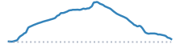

```{=html}
<article class="mobile-route-card" data-bart="North Berkeley" data-miles="11.59" data-elevation="1062.34">

<div class="mobile-route-elevation" aria-hidden="true"></div>
<div class="mobile-route-metrics">
<p><span class="mobile-route-label">BART</span><br>North Berkeley</p>
<p><span class="mobile-route-label">Miles</span><br>11.59</p>
<p><span class="mobile-route-label">Elevation Gain</span><br>1062.34 ft</p>
<p><span class="mobile-route-label">Tech Descents</span><br>0.11 mi</p>
</div>
</article>
```

## Map
<iframe
  src="../data/routes/spruce-up-euclid-down/map.html"
  style="width:100%; height:min(70vh, 560px); min-height:360px; border:none;"
  loading="lazy"
  allowfullscreen
></iframe>

## Data
<table class="dataframe table table-striped table-sm">
  <thead>
    <tr style="text-align: left;">
      <th>Hazard</th>
      <th>Distance (mi)</th>
      <th>Percent</th>
    </tr>
  </thead>
  <tbody>
    <tr>
      <td>Mellow</td>
      <td>8.68</td>
      <td>75.0</td>
    </tr>
    <tr>
      <td>Climb</td>
      <td>2.09</td>
      <td>18.0</td>
    </tr>
    <tr>
      <td>Descent</td>
      <td>0.43</td>
      <td>4.0</td>
    </tr>
    <tr>
      <td>Steep Climb</td>
      <td>0.28</td>
      <td>2.0</td>
    </tr>
    <tr>
      <td>Danger Zone</td>
      <td>0.11</td>
      <td>1.0</td>
    </tr>
  </tbody>
</table>


