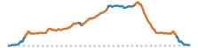

```{=html}
<script>
document.addEventListener("DOMContentLoaded", function () {
  const title = document.querySelector(".quarto-title h1.title");
  if (!title) {
    return;
  }
  title.innerHTML = title.textContent.replace(
    /(\d+% Gravel)/g,
    '<span style="color: chocolate;">$1</span>',
  );
});
</script>
```


```{=html}
<article class="mobile-route-card" data-bart="El Cerrito del Norte" data-miles="17.84" data-elevation="1588.00" data-time="130" data-danger-zone="2.00" data-road-quality="42" data-has-gravel="true">
<div class="mobile-route-heading">

<div class="mobile-route-tags"><span class="mobile-route-tag">Wildcat Creek ↑</span><span class="mobile-route-tag">Meadows Canyon ↑</span><span class="mobile-route-tag">Conlon Trail ↓</span><span class="mobile-route-tag">Wildcat Creek</span></div>
</div>
<div class="mobile-route-elevation" aria-hidden="true"></div>
<div class="mobile-route-metrics">
<p><span class="mobile-route-label">BART</span><br>El Cerrito del Norte</p>
<p><span class="mobile-route-label">Miles</span><br>17.84</p>
<p><span class="mobile-route-label">Elev. Gain</span><br>1588.0 ft</p>
<p><span class="mobile-route-label">Time</span><br>~2:10</p>
<p><span class="mobile-route-label">Danger Zone</span><br>2.00 mi</p>
<p><span class="mobile-route-label">Road Quality</span><br><span class="mobile-route-quality" style="background-color:#ffffbf;">42%</span></p>
</div>
</article>
```
::: {.panel-tabset}

## Map

<iframe
  src="../data/routes/weeknight-alvarado-meadows-conlon/overview_map.html"
  style="width:100%; height:min(70vh, 560px); min-height:360px; border:none;"
  loading="lazy"
  allow="fullscreen"
  webkitallowfullscreen
  mozallowfullscreen
  allowfullscreen
></iframe>

## Grade

<iframe
  src="../data/routes/weeknight-alvarado-meadows-conlon/map.html"
  style="width:100%; height:min(70vh, 560px); min-height:360px; border:none;"
  loading="lazy"
  allow="fullscreen"
  webkitallowfullscreen
  mozallowfullscreen
  allowfullscreen
></iframe>

## Descents

<iframe
  src="../data/routes/weeknight-alvarado-meadows-conlon/descent_chunk_map.html"
  style="width:100%; height:min(70vh, 560px); min-height:360px; border:none;"
  loading="lazy"
  allow="fullscreen"
  webkitallowfullscreen
  mozallowfullscreen
  allowfullscreen
></iframe>

Note that maximum speeds are based on physical model of a rider, subjected to an assumed weight and rolling resistance, coasting down the entire descent without applying the brakes.  

::: {.panel-tabset}

### Danger Zone 

```{=html}
<table class="dataframe table table-striped table-sm">
  <thead>
    <tr style="text-align: left;">
      <th>Section</th>
      <th>Average Grade</th>
      <th>Max Coast Speed</th>
      <th>Good+ Pavement</th>
      <th>Distance (mi)</th>
    </tr>
  </thead>
  <tbody>
    <tr>
      <td>3. Conlon Trail: steep descent</td>
      <td>-9.4%</td>
      <td>48.3 mph</td>
      <td>Gravel</td>
      <td>1.5</td>
    </tr>
    <tr>
      <td>4. Wildcat Creek Trail: steep descent</td>
      <td>-8.2%</td>
      <td>48.6 mph</td>
      <td>Gravel</td>
      <td>0.3</td>
    </tr>
    <tr>
      <td>5. Wildcat Canyon Parkway: steep descent</td>
      <td>-10.9%</td>
      <td>47.0 mph</td>
      <td>0%</td>
      <td>0.2</td>
    </tr>
  </tbody>
</table>
```

"Danger Zone" descents are those where maximum modeled coasting speed reaches above 50mph on any road, or else above 40mph on gravel roads, or those with low-quality pavement (<50% passing). 

### All Descents

```{=html}
<table class="dataframe table table-striped table-sm">
  <thead>
    <tr style="text-align: left;">
      <th>Section</th>
      <th>Average Grade</th>
      <th>Max Coast Speed</th>
      <th>Good+ Pavement</th>
      <th>Distance (mi)</th>
    </tr>
  </thead>
  <tbody>
    <tr>
      <td>TOTAL</td>
      <td>-8.4%</td>
      <td>48.6 mph</td>
      <td>Gravel</td>
      <td>2.4</td>
    </tr>
    <tr>
      <td>1. Wildcat Creek Trail: light descent</td>
      <td>-2.5%</td>
      <td>23.6 mph</td>
      <td>Gravel</td>
      <td>0.2</td>
    </tr>
    <tr>
      <td>2. Conlon Trail: descent</td>
      <td>-5.0%</td>
      <td>38.6 mph</td>
      <td>Gravel</td>
      <td>0.3</td>
    </tr>
    <tr>
      <td>3. Conlon Trail: steep descent</td>
      <td>-9.4%</td>
      <td>48.3 mph</td>
      <td>Gravel</td>
      <td>1.5</td>
    </tr>
    <tr>
      <td>4. Wildcat Creek Trail: steep descent</td>
      <td>-8.2%</td>
      <td>48.6 mph</td>
      <td>Gravel</td>
      <td>0.3</td>
    </tr>
    <tr>
      <td>5. Wildcat Canyon Parkway: steep descent</td>
      <td>-10.9%</td>
      <td>47.0 mph</td>
      <td>0%</td>
      <td>0.2</td>
    </tr>
  </tbody>
</table>
```

:::

## Ascents

<iframe
  src="../data/routes/weeknight-alvarado-meadows-conlon/chunk_map.html"
  style="width:100%; height:min(70vh, 560px); min-height:360px; border:none;"
  loading="lazy"
  allow="fullscreen"
  webkitallowfullscreen
  mozallowfullscreen
  allowfullscreen
></iframe>

::: {.panel-tabset}

### Climbs Only

```{=html}
<table class="dataframe table table-striped table-sm">
  <thead>
    <tr style="text-align: left;">
      <th>Section (avg grade)</th>
      <th>Climb (ft)</th>
      <th>Distance (mi)</th>
      <th>Time (Min)</th>
    </tr>
  </thead>
  <tbody>
    <tr>
      <td>TOTAL</td>
      <td>1,195</td>
      <td>7.1</td>
      <td>65 ± 33</td>
    </tr>
    <tr>
      <td>1. Wildcat Creek Trail (2% avg)</td>
      <td>475</td>
      <td>3.2</td>
      <td>29 ± 15</td>
    </tr>
    <tr>
      <td>2. Loop Road (3% avg)</td>
      <td>139</td>
      <td>1.0</td>
      <td>9 ± 4</td>
    </tr>
    <tr>
      <td>3. Meadows Canyon Trail (5% avg)</td>
      <td>476</td>
      <td>1.9</td>
      <td>19 ± 10</td>
    </tr>
    <tr>
      <td>4. Conlon Trail (2% avg)</td>
      <td>106</td>
      <td>1.0</td>
      <td>8 ± 4</td>
    </tr>
  </tbody>
</table>
```

### With Rest Periods

```{=html}
<table class="dataframe table table-striped table-sm">
  <thead>
    <tr style="text-align: left;">
      <th>Section (avg grade)</th>
      <th>Climb (ft)</th>
      <th>Distance (mi)</th>
      <th>Time (Min)</th>
    </tr>
  </thead>
  <tbody>
    <tr>
      <td>TOTAL</td>
      <td>1,195</td>
      <td>18.0</td>
      <td>130 ± 56</td>
    </tr>
    <tr>
      <td>flat or descent</td>
      <td></td>
      <td>2.0</td>
      <td>11</td>
    </tr>
    <tr>
      <td>1. Wildcat Creek Trail (2% avg)</td>
      <td>475</td>
      <td>3.2</td>
      <td>29 ± 15</td>
    </tr>
    <tr>
      <td>flat or descent</td>
      <td></td>
      <td>1.1</td>
      <td>7</td>
    </tr>
    <tr>
      <td>2. Loop Road (3% avg)</td>
      <td>139</td>
      <td>1.0</td>
      <td>9 ± 4</td>
    </tr>
    <tr>
      <td>flat or descent</td>
      <td></td>
      <td>0.2</td>
      <td>1</td>
    </tr>
    <tr>
      <td>3. Meadows Canyon Trail (5% avg)</td>
      <td>476</td>
      <td>1.9</td>
      <td>19 ± 10</td>
    </tr>
    <tr>
      <td>flat or descent</td>
      <td></td>
      <td>1.9</td>
      <td>12</td>
    </tr>
    <tr>
      <td>4. Conlon Trail (2% avg)</td>
      <td>106</td>
      <td>1.0</td>
      <td>8 ± 4</td>
    </tr>
    <tr>
      <td>flat or descent</td>
      <td></td>
      <td>5.7</td>
      <td>35</td>
    </tr>
  </tbody>
</table>
```

:::

## Street Quality

<iframe
  src="../data/routes/weeknight-alvarado-meadows-conlon/road_quality_map.html"
  style="width:100%; height:min(70vh, 560px); min-height:360px; border:none;"
  loading="lazy"
  allow="fullscreen"
  webkitallowfullscreen
  mozallowfullscreen
  allowfullscreen
></iframe>

```{=html}
<table class="dataframe table table-striped table-sm">
  <thead>
    <tr style="text-align: left;">
      <th>mtc_pci_info</th>
      <th>Miles</th>
      <th>Percent</th>
    </tr>
  </thead>
  <tbody>
    <tr>
      <td>Gravel</td>
      <td>10.7</td>
      <td>59.9</td>
    </tr>
    <tr>
      <td>Cycleway</td>
      <td>2.3</td>
      <td>12.9</td>
    </tr>
    <tr>
      <td>Good</td>
      <td>1.3</td>
      <td>7.5</td>
    </tr>
    <tr>
      <td>Fair</td>
      <td>1.2</td>
      <td>6.8</td>
    </tr>
    <tr>
      <td>Poor</td>
      <td>1.1</td>
      <td>6.0</td>
    </tr>
    <tr>
      <td>At Risk</td>
      <td>0.6</td>
      <td>3.3</td>
    </tr>
    <tr>
      <td>Excellent</td>
      <td>0.5</td>
      <td>2.7</td>
    </tr>
    <tr>
      <td>Unknown</td>
      <td>0.2</td>
      <td>0.9</td>
    </tr>
  </tbody>
</table>
```

:::
