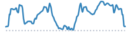

```{=html}
<script>
document.addEventListener("DOMContentLoaded", function () {
  const title = document.querySelector(".quarto-title h1.title");
  if (!title) {
    return;
  }
  title.innerHTML = title.textContent.replace(
    /(\d+% Gravel)/g,
    '<span style="color: chocolate;">$1</span>',
  );
});
</script>
```


```{=html}
<article class="mobile-route-card" data-bart="Civic Center/UN Plaza" data-miles="24.94" data-elevation="1393.00" data-time="151" data-danger-zone="0.00" data-road-quality="61" data-has-gravel="false">
<div class="mobile-route-heading">

<div class="mobile-route-tags"><span class="mobile-route-tag">Golden Gate Bridge</span></div>
</div>
<div class="mobile-route-elevation" aria-hidden="true"></div>
<div class="mobile-route-metrics">
<p><span class="mobile-route-label">BART</span><br>Civic Center/UN Plaza</p>
<p><span class="mobile-route-label">Miles</span><br>24.94</p>
<p><span class="mobile-route-label">Elev. Gain</span><br>1393.0 ft</p>
<p><span class="mobile-route-label">Time</span><br>~2:30</p>
<p><span class="mobile-route-label">Danger Zone</span><br>0.00 mi</p>
<p><span class="mobile-route-label">Road Quality</span><br><span class="mobile-route-quality" style="background-color:#d9ef8b;">61%</span></p>
</div>
</article>
```
::: {.panel-tabset}

## Map

<iframe
  src="../data/routes/weeknight-rodeo-loop/overview_map.html"
  style="width:100%; height:min(70vh, 560px); min-height:360px; border:none;"
  loading="lazy"
  allow="fullscreen"
  webkitallowfullscreen
  mozallowfullscreen
  allowfullscreen
></iframe>

## Grade

<iframe
  src="../data/routes/weeknight-rodeo-loop/map.html"
  style="width:100%; height:min(70vh, 560px); min-height:360px; border:none;"
  loading="lazy"
  allow="fullscreen"
  webkitallowfullscreen
  mozallowfullscreen
  allowfullscreen
></iframe>

## Descents

<iframe
  src="../data/routes/weeknight-rodeo-loop/descent_chunk_map.html"
  style="width:100%; height:min(70vh, 560px); min-height:360px; border:none;"
  loading="lazy"
  allow="fullscreen"
  webkitallowfullscreen
  mozallowfullscreen
  allowfullscreen
></iframe>

Note that maximum speeds are based on physical model of a rider, subjected to an assumed weight and rolling resistance, coasting down the entire descent without applying the brakes.  

::: {.panel-tabset}

### Danger Zone 

```{=html}
<table class="dataframe table table-striped table-sm">
  <thead>
    <tr style="text-align: left;">
      <th>Section</th>
      <th>Average Grade</th>
      <th>Max Coast Speed</th>
      <th>Good+ Pavement</th>
      <th>Distance (mi)</th>
    </tr>
  </thead>
  <tbody>
  </tbody>
</table>
```

"Danger Zone" descents are those where maximum modeled coasting speed reaches above 50mph on any road, or else above 40mph on gravel roads, or those with low-quality pavement (<50% passing). 

### All Descents

```{=html}
<table class="dataframe table table-striped table-sm">
  <thead>
    <tr style="text-align: left;">
      <th>Section</th>
      <th>Average Grade</th>
      <th>Max Coast Speed</th>
      <th>Good+ Pavement</th>
      <th>Distance (mi)</th>
    </tr>
  </thead>
  <tbody>
    <tr>
      <td>TOTAL</td>
      <td>-4.3%</td>
      <td>37.0 mph</td>
      <td>35%</td>
      <td>5.0</td>
    </tr>
    <tr>
      <td>1. Page Street: light descent</td>
      <td>-2.8%</td>
      <td>20.0 mph</td>
      <td>100%</td>
      <td>0.2</td>
    </tr>
    <tr>
      <td>2. Arguello Boulevard: light descent</td>
      <td>-4.0%</td>
      <td>27.1 mph</td>
      <td>87%</td>
      <td>0.3</td>
    </tr>
    <tr>
      <td>3. Arguello Boulevard: descent</td>
      <td>-6.8%</td>
      <td>36.1 mph</td>
      <td>0%</td>
      <td>0.6</td>
    </tr>
    <tr>
      <td>4. Bunker Road: light descent</td>
      <td>-4.1%</td>
      <td>29.4 mph</td>
      <td>0%</td>
      <td>0.7</td>
    </tr>
    <tr>
      <td>5. Rodeo Valley Trail: light descent</td>
      <td>-3.4%</td>
      <td>23.4 mph</td>
      <td>Gravel</td>
      <td>0.2</td>
    </tr>
    <tr>
      <td>6. Rodeo Valley Trail: light descent</td>
      <td>-4.1%</td>
      <td>23.1 mph</td>
      <td>Gravel</td>
      <td>0.3</td>
    </tr>
    <tr>
      <td>7. Bunker Road: light descent</td>
      <td>-3.6%</td>
      <td>27.9 mph</td>
      <td>0%</td>
      <td>0.2</td>
    </tr>
    <tr>
      <td>8. Baker-Barry Tunnel (Bunker Road): light descent</td>
      <td>-3.2%</td>
      <td>25.8 mph</td>
      <td>0%</td>
      <td>0.7</td>
    </tr>
    <tr>
      <td>9. Golden Gate Bridge West Sidewalk: light descent</td>
      <td>-3.8%</td>
      <td>25.7 mph</td>
      <td>0%</td>
      <td>0.3</td>
    </tr>
    <tr>
      <td>10. Arguello Boulevard: descent</td>
      <td>-4.8%</td>
      <td>31.8 mph</td>
      <td>100%</td>
      <td>0.4</td>
    </tr>
    <tr>
      <td>11. Conservatory Drive East: light descent</td>
      <td>-3.2%</td>
      <td>21.8 mph</td>
      <td>0%</td>
      <td>0.3</td>
    </tr>
    <tr>
      <td>12. Page Street: light descent</td>
      <td>-5.0%</td>
      <td>26.7 mph</td>
      <td>100%</td>
      <td>0.3</td>
    </tr>
    <tr>
      <td>13. Page Street: descent</td>
      <td>-5.2%</td>
      <td>37.0 mph</td>
      <td>96%</td>
      <td>0.5</td>
    </tr>
  </tbody>
</table>
```

:::

## Ascents

<iframe
  src="../data/routes/weeknight-rodeo-loop/chunk_map.html"
  style="width:100%; height:min(70vh, 560px); min-height:360px; border:none;"
  loading="lazy"
  allow="fullscreen"
  webkitallowfullscreen
  mozallowfullscreen
  allowfullscreen
></iframe>

::: {.panel-tabset}

### Climbs Only

```{=html}
<table class="dataframe table table-striped table-sm">
  <thead>
    <tr style="text-align: left;">
      <th>Section (avg grade)</th>
      <th>Climb (ft)</th>
      <th>Distance (mi)</th>
      <th>Time (Min)</th>
    </tr>
  </thead>
  <tbody>
    <tr>
      <td>TOTAL</td>
      <td>630</td>
      <td>4.0</td>
      <td>31 ± 13</td>
    </tr>
    <tr>
      <td>1. Arguello Boulevard (5% avg)</td>
      <td>79</td>
      <td>0.3</td>
      <td>3 ± 2</td>
    </tr>
    <tr>
      <td>2. Lincoln Boulevard (3% avg)</td>
      <td>104</td>
      <td>0.7</td>
      <td>6 ± 3</td>
    </tr>
    <tr>
      <td>3. Danes Drive (3% avg)</td>
      <td>101</td>
      <td>0.7</td>
      <td>4 ± 1</td>
    </tr>
    <tr>
      <td>4. Bunker Road (4% avg)</td>
      <td>202</td>
      <td>1.1</td>
      <td>10 ± 4</td>
    </tr>
    <tr>
      <td>5. Washington Boulevard (2% avg)</td>
      <td>145</td>
      <td>1.2</td>
      <td>9 ± 3</td>
    </tr>
  </tbody>
</table>
```

### With Rest Periods

```{=html}
<table class="dataframe table table-striped table-sm">
  <thead>
    <tr style="text-align: left;">
      <th>Section (avg grade)</th>
      <th>Climb (ft)</th>
      <th>Distance (mi)</th>
      <th>Time (Min)</th>
    </tr>
  </thead>
  <tbody>
    <tr>
      <td>TOTAL</td>
      <td>630</td>
      <td>24.9</td>
      <td>151 ± 52</td>
    </tr>
    <tr>
      <td>flat or descent</td>
      <td></td>
      <td>4.0</td>
      <td>25</td>
    </tr>
    <tr>
      <td>1. Arguello Boulevard (5% avg)</td>
      <td>79</td>
      <td>0.3</td>
      <td>3 ± 2</td>
    </tr>
    <tr>
      <td>flat or descent</td>
      <td></td>
      <td>1.7</td>
      <td>10</td>
    </tr>
    <tr>
      <td>2. Lincoln Boulevard (3% avg)</td>
      <td>104</td>
      <td>0.7</td>
      <td>6 ± 3</td>
    </tr>
    <tr>
      <td>flat or descent</td>
      <td></td>
      <td>2.2</td>
      <td>12</td>
    </tr>
    <tr>
      <td>3. Danes Drive (3% avg)</td>
      <td>101</td>
      <td>0.7</td>
      <td>4 ± 1</td>
    </tr>
    <tr>
      <td>flat or descent</td>
      <td></td>
      <td>4.8</td>
      <td>28</td>
    </tr>
    <tr>
      <td>4. Bunker Road (4% avg)</td>
      <td>202</td>
      <td>1.1</td>
      <td>10 ± 4</td>
    </tr>
    <tr>
      <td>flat or descent</td>
      <td></td>
      <td>3.0</td>
      <td>17</td>
    </tr>
    <tr>
      <td>5. Washington Boulevard (2% avg)</td>
      <td>145</td>
      <td>1.2</td>
      <td>9 ± 3</td>
    </tr>
    <tr>
      <td>flat or descent</td>
      <td></td>
      <td>5.2</td>
      <td>28</td>
    </tr>
  </tbody>
</table>
```

:::

## Street Quality

<iframe
  src="../data/routes/weeknight-rodeo-loop/road_quality_map.html"
  style="width:100%; height:min(70vh, 560px); min-height:360px; border:none;"
  loading="lazy"
  allow="fullscreen"
  webkitallowfullscreen
  mozallowfullscreen
  allowfullscreen
></iframe>

```{=html}
<table class="dataframe table table-striped table-sm">
  <thead>
    <tr style="text-align: left;">
      <th>mtc_pci_info</th>
      <th>Miles</th>
      <th>Percent</th>
    </tr>
  </thead>
  <tbody>
    <tr>
      <td>Very Good</td>
      <td>4.4</td>
      <td>17.8</td>
    </tr>
    <tr>
      <td>Cycleway</td>
      <td>4.0</td>
      <td>16.1</td>
    </tr>
    <tr>
      <td>Gravel</td>
      <td>1.6</td>
      <td>6.4</td>
    </tr>
    <tr>
      <td>Good</td>
      <td>1.3</td>
      <td>5.3</td>
    </tr>
    <tr>
      <td>Excellent</td>
      <td>0.9</td>
      <td>3.5</td>
    </tr>
    <tr>
      <td>At Risk</td>
      <td>0.3</td>
      <td>1.1</td>
    </tr>
    <tr>
      <td>Poor</td>
      <td>0.0</td>
      <td>0.1</td>
    </tr>
    <tr>
      <td>Unknown</td>
      <td>12.4</td>
      <td>49.8</td>
    </tr>
  </tbody>
</table>
```

:::
