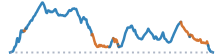

```{=html}
<script>
document.addEventListener("DOMContentLoaded", function () {
  const title = document.querySelector(".quarto-title h1.title");
  if (!title) {
    return;
  }
  title.innerHTML = title.textContent.replace(
    /(\d+% Gravel)/g,
    '<span style="color: chocolate;">$1</span>',
  );
});
</script>
```


```{=html}
<article class="mobile-route-card" data-bart="El Cerrito del Norte" data-miles="63.82" data-elevation="5647.00" data-time="439" data-danger-zone="1.30" data-road-quality="80" data-has-gravel="true">
<div class="mobile-route-heading">

<div class="mobile-route-tags"><span class="mobile-route-tag">Arlington ↑</span><span class="mobile-route-tag">Grizzly Peak ↑</span><span class="mobile-route-tag">Skyline ↓</span><span class="mobile-route-tag">Goldenrod Trail ↓</span><span class="mobile-route-tag">Redwood Road ↑</span><span class="mobile-route-tag">Wildcat Canyon ↑</span><span class="mobile-route-tag">Meadows Canyon ↓</span><span class="mobile-route-tag">Wildcat Creek ↓</span></div>
</div>
<div class="mobile-route-elevation" aria-hidden="true"></div>
<div class="mobile-route-metrics">
<p><span class="mobile-route-label">BART</span><br>El Cerrito del Norte</p>
<p><span class="mobile-route-label">Miles</span><br>63.82</p>
<p><span class="mobile-route-label">Elev. Gain</span><br>5647.0 ft</p>
<p><span class="mobile-route-label">Time</span><br>~7:20</p>
<p><span class="mobile-route-label">Danger Zone</span><br>1.30 mi</p>
<p><span class="mobile-route-label">Road Quality</span><br><span class="mobile-route-quality" style="background-color:#91cf60;">80%</span></p>
</div>
</article>
```
::: {.panel-tabset}

## Map

<iframe
  src="../data/routes/whole-ridge-and-back/overview_map.html"
  style="width:100%; height:min(70vh, 560px); min-height:360px; border:none;"
  loading="lazy"
  allow="fullscreen"
  webkitallowfullscreen
  mozallowfullscreen
  allowfullscreen
></iframe>

## Grade

<iframe
  src="../data/routes/whole-ridge-and-back/map.html"
  style="width:100%; height:min(70vh, 560px); min-height:360px; border:none;"
  loading="lazy"
  allow="fullscreen"
  webkitallowfullscreen
  mozallowfullscreen
  allowfullscreen
></iframe>

## Descents

<iframe
  src="../data/routes/whole-ridge-and-back/descent_chunk_map.html"
  style="width:100%; height:min(70vh, 560px); min-height:360px; border:none;"
  loading="lazy"
  allow="fullscreen"
  webkitallowfullscreen
  mozallowfullscreen
  allowfullscreen
></iframe>

Note that maximum speeds are based on physical model of a rider, subjected to an assumed weight and rolling resistance, coasting down the entire descent without applying the brakes.  

::: {.panel-tabset}

### Danger Zone 

```{=html}
<table class="dataframe table table-striped table-sm">
  <thead>
    <tr style="text-align: left;">
      <th>Section</th>
      <th>Average Grade</th>
      <th>Max Coast Speed</th>
      <th>Good+ Pavement</th>
      <th>Distance (mi)</th>
    </tr>
  </thead>
  <tbody>
    <tr>
      <td>14. Goldenrod Trail: steep descent</td>
      <td>-10.7%</td>
      <td>41.7 mph</td>
      <td>Gravel</td>
      <td>0.2</td>
    </tr>
    <tr>
      <td>15. Goldenrod Trail: steep descent</td>
      <td>-8.0%</td>
      <td>46.1 mph</td>
      <td>Gravel</td>
      <td>0.6</td>
    </tr>
    <tr>
      <td>35. Wildcat Creek Trail: steep descent</td>
      <td>-8.2%</td>
      <td>48.6 mph</td>
      <td>Gravel</td>
      <td>0.3</td>
    </tr>
    <tr>
      <td>36. Wildcat Canyon Parkway: steep descent</td>
      <td>-10.9%</td>
      <td>47.0 mph</td>
      <td>0%</td>
      <td>0.2</td>
    </tr>
  </tbody>
</table>
```

"Danger Zone" descents are those where maximum modeled coasting speed reaches above 50mph on any road, or else above 40mph on gravel roads, or those with low-quality pavement (<50% passing). 

### All Descents

```{=html}
<table class="dataframe table table-striped table-sm">
  <thead>
    <tr style="text-align: left;">
      <th>Section</th>
      <th>Average Grade</th>
      <th>Max Coast Speed</th>
      <th>Good+ Pavement</th>
      <th>Distance (mi)</th>
    </tr>
  </thead>
  <tbody>
    <tr>
      <td>TOTAL</td>
      <td>-5.0%</td>
      <td>48.6 mph</td>
      <td>56%</td>
      <td>19.7</td>
    </tr>
    <tr>
      <td>1. Arlington Boulevard: descent</td>
      <td>-5.3%</td>
      <td>33.4 mph</td>
      <td>100%</td>
      <td>0.5</td>
    </tr>
    <tr>
      <td>2. Arlington Boulevard: light descent</td>
      <td>-3.7%</td>
      <td>27.1 mph</td>
      <td>100%</td>
      <td>0.4</td>
    </tr>
    <tr>
      <td>3. Arlington Boulevard: light descent</td>
      <td>-3.2%</td>
      <td>26.3 mph</td>
      <td>100%</td>
      <td>0.3</td>
    </tr>
    <tr>
      <td>4. Grizzly Peak Boulevard: descent</td>
      <td>-5.1%</td>
      <td>37.0 mph</td>
      <td>70%</td>
      <td>1.3</td>
    </tr>
    <tr>
      <td>5. Grizzly Peak Boulevard: light descent</td>
      <td>-3.9%</td>
      <td>27.4 mph</td>
      <td>100%</td>
      <td>0.2</td>
    </tr>
    <tr>
      <td>6. Skyline Boulevard: descent</td>
      <td>-4.6%</td>
      <td>33.3 mph</td>
      <td>50%</td>
      <td>0.8</td>
    </tr>
    <tr>
      <td>7. Skyline Boulevard: descent</td>
      <td>-5.8%</td>
      <td>32.5 mph</td>
      <td>23%</td>
      <td>1.2</td>
    </tr>
    <tr>
      <td>8. Skyline Boulevard: light descent</td>
      <td>-5.0%</td>
      <td>30.9 mph</td>
      <td>100%</td>
      <td>0.4</td>
    </tr>
    <tr>
      <td>9. Skyline Boulevard: light descent</td>
      <td>-3.3%</td>
      <td>27.7 mph</td>
      <td>100%</td>
      <td>0.5</td>
    </tr>
    <tr>
      <td>10. Skyline Boulevard: descent</td>
      <td>-5.3%</td>
      <td>33.6 mph</td>
      <td>100%</td>
      <td>0.6</td>
    </tr>
    <tr>
      <td>11. Skyline Boulevard: descent</td>
      <td>-6.2%</td>
      <td>34.1 mph</td>
      <td>100%</td>
      <td>0.4</td>
    </tr>
    <tr>
      <td>12. Skyline Boulevard: light descent</td>
      <td>-4.0%</td>
      <td>26.5 mph</td>
      <td>0%</td>
      <td>0.3</td>
    </tr>
    <tr>
      <td>13. Skyline Boulevard: descent</td>
      <td>-5.7%</td>
      <td>35.0 mph</td>
      <td>0%</td>
      <td>0.8</td>
    </tr>
    <tr>
      <td>14. Goldenrod Trail: steep descent</td>
      <td>-10.7%</td>
      <td>41.7 mph</td>
      <td>Gravel</td>
      <td>0.2</td>
    </tr>
    <tr>
      <td>15. Goldenrod Trail: steep descent</td>
      <td>-8.0%</td>
      <td>46.1 mph</td>
      <td>Gravel</td>
      <td>0.6</td>
    </tr>
    <tr>
      <td>16. Goldenrod Trail: descent</td>
      <td>-4.5%</td>
      <td>33.0 mph</td>
      <td>Gravel</td>
      <td>0.5</td>
    </tr>
    <tr>
      <td>17. Ten Hills Trail: descent</td>
      <td>-6.0%</td>
      <td>34.6 mph</td>
      <td>Gravel</td>
      <td>0.4</td>
    </tr>
    <tr>
      <td>18. Ten Hills Trail: light descent</td>
      <td>-2.2%</td>
      <td>25.6 mph</td>
      <td>Gravel</td>
      <td>0.3</td>
    </tr>
    <tr>
      <td>19. Unknown Road: descent</td>
      <td>-6.0%</td>
      <td>33.3 mph</td>
      <td>Gravel</td>
      <td>0.3</td>
    </tr>
    <tr>
      <td>20. Unknown Road: descent</td>
      <td>-5.4%</td>
      <td>38.6 mph</td>
      <td>Gravel</td>
      <td>0.4</td>
    </tr>
    <tr>
      <td>21. Redwood Road: descent</td>
      <td>-5.1%</td>
      <td>33.8 mph</td>
      <td>100%</td>
      <td>0.7</td>
    </tr>
    <tr>
      <td>22. Redwood Road: descent</td>
      <td>-5.4%</td>
      <td>33.9 mph</td>
      <td>100%</td>
      <td>0.6</td>
    </tr>
    <tr>
      <td>23. Redwood Road: descent</td>
      <td>-4.6%</td>
      <td>34.6 mph</td>
      <td>100%</td>
      <td>0.5</td>
    </tr>
    <tr>
      <td>24. Pinehurst Road: descent</td>
      <td>-4.6%</td>
      <td>33.4 mph</td>
      <td>100%</td>
      <td>1.3</td>
    </tr>
    <tr>
      <td>25. Canyon Road: light descent</td>
      <td>-3.8%</td>
      <td>29.1 mph</td>
      <td>100%</td>
      <td>0.6</td>
    </tr>
    <tr>
      <td>26. Moraga Way: light descent</td>
      <td>-2.8%</td>
      <td>24.9 mph</td>
      <td>100%</td>
      <td>1.5</td>
    </tr>
    <tr>
      <td>27. Camino Pablo: light descent</td>
      <td>-2.9%</td>
      <td>21.7 mph</td>
      <td>100%</td>
      <td>0.3</td>
    </tr>
    <tr>
      <td>28. Camino Pablo: light descent</td>
      <td>-2.4%</td>
      <td>20.5 mph</td>
      <td>100%</td>
      <td>0.3</td>
    </tr>
    <tr>
      <td>29. Meadows Canyon Trail: descent</td>
      <td>-5.0%</td>
      <td>36.7 mph</td>
      <td>Gravel</td>
      <td>1.2</td>
    </tr>
    <tr>
      <td>30. Meadows Canyon Trail: descent</td>
      <td>-7.0%</td>
      <td>37.2 mph</td>
      <td>Gravel</td>
      <td>0.5</td>
    </tr>
    <tr>
      <td>31. Loop Road: light descent</td>
      <td>-4.4%</td>
      <td>28.2 mph</td>
      <td>Gravel</td>
      <td>0.4</td>
    </tr>
    <tr>
      <td>32. Wildcat Creek Trail: light descent</td>
      <td>-3.0%</td>
      <td>26.1 mph</td>
      <td>Gravel</td>
      <td>0.2</td>
    </tr>
    <tr>
      <td>33. Wildcat Creek Trail: light descent</td>
      <td>-3.3%</td>
      <td>26.6 mph</td>
      <td>Gravel</td>
      <td>0.2</td>
    </tr>
    <tr>
      <td>34. Wildcat Creek Trail: descent</td>
      <td>-6.1%</td>
      <td>37.4 mph</td>
      <td>Gravel</td>
      <td>0.3</td>
    </tr>
    <tr>
      <td>35. Wildcat Creek Trail: steep descent</td>
      <td>-8.2%</td>
      <td>48.6 mph</td>
      <td>Gravel</td>
      <td>0.3</td>
    </tr>
    <tr>
      <td>36. Wildcat Canyon Parkway: steep descent</td>
      <td>-10.9%</td>
      <td>47.0 mph</td>
      <td>0%</td>
      <td>0.2</td>
    </tr>
  </tbody>
</table>
```

:::

## Ascents

<iframe
  src="../data/routes/whole-ridge-and-back/chunk_map.html"
  style="width:100%; height:min(70vh, 560px); min-height:360px; border:none;"
  loading="lazy"
  allow="fullscreen"
  webkitallowfullscreen
  mozallowfullscreen
  allowfullscreen
></iframe>

::: {.panel-tabset}

### Climbs Only

```{=html}
<table class="dataframe table table-striped table-sm">
  <thead>
    <tr style="text-align: left;">
      <th>Section (avg grade)</th>
      <th>Climb (ft)</th>
      <th>Distance (mi)</th>
      <th>Time (Min)</th>
    </tr>
  </thead>
  <tbody>
    <tr>
      <td>TOTAL</td>
      <td>4,247</td>
      <td>18.7</td>
      <td>177 ± 87</td>
    </tr>
    <tr>
      <td>1. Arlington Boulevard (5% avg)</td>
      <td>368</td>
      <td>1.5</td>
      <td>16 ± 8</td>
    </tr>
    <tr>
      <td>2. Arlington Boulevard (8% avg)</td>
      <td>361</td>
      <td>0.8</td>
      <td>12 ± 7</td>
    </tr>
    <tr>
      <td>3. Ye Olde School Trail (3% avg)</td>
      <td>163</td>
      <td>1.1</td>
      <td>9 ± 4</td>
    </tr>
    <tr>
      <td>4. Grizzly Peak Boulevard (6% avg)</td>
      <td>115</td>
      <td>0.4</td>
      <td>4 ± 2</td>
    </tr>
    <tr>
      <td>5. Grizzly Peak Boulevard (4% avg)</td>
      <td>160</td>
      <td>0.8</td>
      <td>7 ± 3</td>
    </tr>
    <tr>
      <td>6. Grizzly Peak Boulevard (5% avg)</td>
      <td>581</td>
      <td>2.2</td>
      <td>22 ± 11</td>
    </tr>
    <tr>
      <td>7. Grizzly Peak Boulevard (6% avg)</td>
      <td>84</td>
      <td>0.3</td>
      <td>4 ± 2</td>
    </tr>
    <tr>
      <td>8. Skyline Boulevard (2% avg)</td>
      <td>188</td>
      <td>1.5</td>
      <td>12 ± 6</td>
    </tr>
    <tr>
      <td>9. Skyline Boulevard (2% avg)</td>
      <td>83</td>
      <td>0.7</td>
      <td>5 ± 2</td>
    </tr>
    <tr>
      <td>10. Skyline Boulevard (4% avg)</td>
      <td>78</td>
      <td>0.4</td>
      <td>3 ± 1</td>
    </tr>
    <tr>
      <td>11. East Shore Trail (9% avg)</td>
      <td>232</td>
      <td>0.5</td>
      <td>7 ± 4</td>
    </tr>
    <tr>
      <td>12. Ten Hills Trail (6% avg)</td>
      <td>75</td>
      <td>0.3</td>
      <td>4 ± 2</td>
    </tr>
    <tr>
      <td>13. Redwood Road (5% avg)</td>
      <td>576</td>
      <td>2.3</td>
      <td>22 ± 10</td>
    </tr>
    <tr>
      <td>14. Pinehurst Road (4% avg)</td>
      <td>320</td>
      <td>1.4</td>
      <td>14 ± 7</td>
    </tr>
    <tr>
      <td>15. Canyon Road (2% avg)</td>
      <td>82</td>
      <td>0.7</td>
      <td>5 ± 2</td>
    </tr>
    <tr>
      <td>16. Moraga Way (3% avg)</td>
      <td>158</td>
      <td>1.2</td>
      <td>8 ± 2</td>
    </tr>
    <tr>
      <td>17. Wildcat Canyon Road (7% avg)</td>
      <td>388</td>
      <td>1.1</td>
      <td>13 ± 8</td>
    </tr>
    <tr>
      <td>18. Wildcat Canyon Road (4% avg)</td>
      <td>185</td>
      <td>1.1</td>
      <td>9 ± 4</td>
    </tr>
    <tr>
      <td>19. Meadows Canyon Trail (1% avg)</td>
      <td>51</td>
      <td>0.4</td>
      <td>3 ± 2</td>
    </tr>
  </tbody>
</table>
```

### With Rest Periods

```{=html}
<table class="dataframe table table-striped table-sm">
  <thead>
    <tr style="text-align: left;">
      <th>Section (avg grade)</th>
      <th>Climb (ft)</th>
      <th>Distance (mi)</th>
      <th>Time (Min)</th>
    </tr>
  </thead>
  <tbody>
    <tr>
      <td>TOTAL</td>
      <td>4,247</td>
      <td>63.7</td>
      <td>439 ± 173</td>
    </tr>
    <tr>
      <td>flat or descent</td>
      <td></td>
      <td>2.0</td>
      <td>11</td>
    </tr>
    <tr>
      <td>1. Arlington Boulevard (5% avg)</td>
      <td>368</td>
      <td>1.5</td>
      <td>16 ± 8</td>
    </tr>
    <tr>
      <td>flat or descent</td>
      <td></td>
      <td>0.5</td>
      <td>2</td>
    </tr>
    <tr>
      <td>2. Arlington Boulevard (8% avg)</td>
      <td>361</td>
      <td>0.8</td>
      <td>12 ± 7</td>
    </tr>
    <tr>
      <td>flat or descent</td>
      <td></td>
      <td>1.0</td>
      <td>6</td>
    </tr>
    <tr>
      <td>3. Ye Olde School Trail (3% avg)</td>
      <td>163</td>
      <td>1.1</td>
      <td>9 ± 4</td>
    </tr>
    <tr>
      <td>flat or descent</td>
      <td></td>
      <td>0.2</td>
      <td>1</td>
    </tr>
    <tr>
      <td>4. Grizzly Peak Boulevard (6% avg)</td>
      <td>115</td>
      <td>0.4</td>
      <td>4 ± 2</td>
    </tr>
    <tr>
      <td>flat or descent</td>
      <td></td>
      <td>0.1</td>
      <td>1</td>
    </tr>
    <tr>
      <td>5. Grizzly Peak Boulevard (4% avg)</td>
      <td>160</td>
      <td>0.8</td>
      <td>7 ± 3</td>
    </tr>
    <tr>
      <td>flat or descent</td>
      <td></td>
      <td>0.2</td>
      <td>1</td>
    </tr>
    <tr>
      <td>6. Grizzly Peak Boulevard (5% avg)</td>
      <td>581</td>
      <td>2.2</td>
      <td>22 ± 11</td>
    </tr>
    <tr>
      <td>flat or descent</td>
      <td></td>
      <td>1.6</td>
      <td>8</td>
    </tr>
    <tr>
      <td>7. Grizzly Peak Boulevard (6% avg)</td>
      <td>84</td>
      <td>0.3</td>
      <td>4 ± 2</td>
    </tr>
    <tr>
      <td>flat or descent</td>
      <td></td>
      <td>3.4</td>
      <td>20</td>
    </tr>
    <tr>
      <td>8. Skyline Boulevard (2% avg)</td>
      <td>188</td>
      <td>1.5</td>
      <td>12 ± 6</td>
    </tr>
    <tr>
      <td>flat or descent</td>
      <td></td>
      <td>0.2</td>
      <td>1</td>
    </tr>
    <tr>
      <td>9. Skyline Boulevard (2% avg)</td>
      <td>83</td>
      <td>0.7</td>
      <td>5 ± 2</td>
    </tr>
    <tr>
      <td>flat or descent</td>
      <td></td>
      <td>2.9</td>
      <td>17</td>
    </tr>
    <tr>
      <td>10. Skyline Boulevard (4% avg)</td>
      <td>78</td>
      <td>0.4</td>
      <td>3 ± 1</td>
    </tr>
    <tr>
      <td>flat or descent</td>
      <td></td>
      <td>7.8</td>
      <td>48</td>
    </tr>
    <tr>
      <td>11. East Shore Trail (9% avg)</td>
      <td>232</td>
      <td>0.5</td>
      <td>7 ± 4</td>
    </tr>
    <tr>
      <td>flat or descent</td>
      <td></td>
      <td>0.6</td>
      <td>3</td>
    </tr>
    <tr>
      <td>12. Ten Hills Trail (6% avg)</td>
      <td>75</td>
      <td>0.3</td>
      <td>4 ± 2</td>
    </tr>
    <tr>
      <td>flat or descent</td>
      <td></td>
      <td>2.6</td>
      <td>14</td>
    </tr>
    <tr>
      <td>13. Redwood Road (5% avg)</td>
      <td>576</td>
      <td>2.3</td>
      <td>22 ± 10</td>
    </tr>
    <tr>
      <td>flat or descent</td>
      <td></td>
      <td>4.2</td>
      <td>24</td>
    </tr>
    <tr>
      <td>14. Pinehurst Road (4% avg)</td>
      <td>320</td>
      <td>1.4</td>
      <td>14 ± 7</td>
    </tr>
    <tr>
      <td>flat or descent</td>
      <td></td>
      <td>1.2</td>
      <td>6</td>
    </tr>
    <tr>
      <td>15. Canyon Road (2% avg)</td>
      <td>82</td>
      <td>0.7</td>
      <td>5 ± 2</td>
    </tr>
    <tr>
      <td>flat or descent</td>
      <td></td>
      <td>2.9</td>
      <td>16</td>
    </tr>
    <tr>
      <td>16. Moraga Way (3% avg)</td>
      <td>158</td>
      <td>1.2</td>
      <td>8 ± 2</td>
    </tr>
    <tr>
      <td>flat or descent</td>
      <td></td>
      <td>4.4</td>
      <td>24</td>
    </tr>
    <tr>
      <td>17. Wildcat Canyon Road (7% avg)</td>
      <td>388</td>
      <td>1.1</td>
      <td>13 ± 8</td>
    </tr>
    <tr>
      <td>flat or descent</td>
      <td></td>
      <td>0.1</td>
      <td>1</td>
    </tr>
    <tr>
      <td>18. Wildcat Canyon Road (4% avg)</td>
      <td>185</td>
      <td>1.1</td>
      <td>9 ± 4</td>
    </tr>
    <tr>
      <td>flat or descent</td>
      <td></td>
      <td>1.7</td>
      <td>9</td>
    </tr>
    <tr>
      <td>19. Meadows Canyon Trail (1% avg)</td>
      <td>51</td>
      <td>0.4</td>
      <td>3 ± 2</td>
    </tr>
    <tr>
      <td>flat or descent</td>
      <td></td>
      <td>7.4</td>
      <td>48</td>
    </tr>
  </tbody>
</table>
```

:::

## Street Quality

<iframe
  src="../data/routes/whole-ridge-and-back/road_quality_map.html"
  style="width:100%; height:min(70vh, 560px); min-height:360px; border:none;"
  loading="lazy"
  allow="fullscreen"
  webkitallowfullscreen
  mozallowfullscreen
  allowfullscreen
></iframe>

```{=html}
<table class="dataframe table table-striped table-sm">
  <thead>
    <tr style="text-align: left;">
      <th>mtc_pci_info</th>
      <th>Miles</th>
      <th>Percent</th>
    </tr>
  </thead>
  <tbody>
    <tr>
      <td>Good</td>
      <td>23.3</td>
      <td>36.5</td>
    </tr>
    <tr>
      <td>Gravel</td>
      <td>13.3</td>
      <td>20.9</td>
    </tr>
    <tr>
      <td>Very Good</td>
      <td>7.1</td>
      <td>11.1</td>
    </tr>
    <tr>
      <td>Fair</td>
      <td>6.2</td>
      <td>9.8</td>
    </tr>
    <tr>
      <td>Poor</td>
      <td>5.8</td>
      <td>9.0</td>
    </tr>
    <tr>
      <td>Excellent</td>
      <td>3.7</td>
      <td>5.7</td>
    </tr>
    <tr>
      <td>At Risk</td>
      <td>1.2</td>
      <td>1.9</td>
    </tr>
    <tr>
      <td>Cycleway</td>
      <td>1.1</td>
      <td>1.7</td>
    </tr>
    <tr>
      <td>Unknown</td>
      <td>2.1</td>
      <td>3.3</td>
    </tr>
  </tbody>
</table>
```

:::
