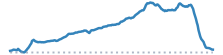

```{=html}
<script>
document.addEventListener("DOMContentLoaded", function () {
  const title = document.querySelector(".quarto-title h1.title");
  if (!title) {
    return;
  }
  title.innerHTML = title.textContent.replace(
    /(\d+% Gravel)/g,
    '<span style="color: chocolate;">$1</span>',
  );
});
</script>
```


```{=html}
<article class="mobile-route-card" data-bart="MacArthur" data-miles="19.47" data-elevation="1980.40" data-time="137" data-road-quality="54" data-has-gravel="false">
<div class="mobile-route-heading">

<div class="mobile-route-tags"><span class="mobile-route-tag">Wildwood+Leimert ↑</span><span class="mobile-route-tag">Butters Canyon ↑</span><span class="mobile-route-tag">Skyline ↑</span><span class="mobile-route-tag">Claremont ↓</span></div>
</div>
<div class="mobile-route-elevation" aria-hidden="true"></div>
<div class="mobile-route-metrics">
<p><span class="mobile-route-label">BART</span><br>MacArthur</p>
<p><span class="mobile-route-label">Miles</span><br>19.47</p>
<p><span class="mobile-route-label">Elev. Gain</span><br>1980.4 ft</p>
<p><span class="mobile-route-label">Time</span><br>~2:20</p>
<p><span class="mobile-route-label">Danger Zone</span><br>0.00 mi</p>
<p><span class="mobile-route-label">Road Quality</span><br><span class="mobile-route-quality" style="background-color:#ffffbf;">54%</span></p>
</div>
</article>
```
::: {.panel-tabset}

## Map

<iframe
  src="../data/routes/wildwood-bbr-loop/overview_map.html"
  style="width:100%; height:min(70vh, 560px); min-height:360px; border:none;"
  loading="lazy"
  allow="fullscreen"
  webkitallowfullscreen
  mozallowfullscreen
  allowfullscreen
></iframe>

## Grade

<iframe
  src="../data/routes/wildwood-bbr-loop/map.html"
  style="width:100%; height:min(70vh, 560px); min-height:360px; border:none;"
  loading="lazy"
  allow="fullscreen"
  webkitallowfullscreen
  mozallowfullscreen
  allowfullscreen
></iframe>

## Descents

<iframe
  src="../data/routes/wildwood-bbr-loop/descent_chunk_map.html"
  style="width:100%; height:min(70vh, 560px); min-height:360px; border:none;"
  loading="lazy"
  allow="fullscreen"
  webkitallowfullscreen
  mozallowfullscreen
  allowfullscreen
></iframe>

Note that maximum speeds are based on a physical model of a rider, subjected to an assumed weight and rolling resistance, coasting down the entire descent without applying the brakes.  

::: {.panel-tabset}

### Danger Zone

"Danger Zone" descents are those where maximum modeled coasting speed reaches above 50mph on any road, or else above 40mph on gravel roads, or those with low-quality pavement (<50% passing).  

```{=html}
<table class="dataframe table table-striped table-sm">
  <thead>
    <tr style="text-align: left;">
      <th>Section</th>
      <th>Average Grade</th>
      <th>Max Coast Speed</th>
      <th>Good+ Pavement</th>
      <th>Distance (mi)</th>
    </tr>
  </thead>
  <tbody>
  </tbody>
</table>
```

### All Descents

```{=html}
<table class="dataframe table table-striped table-sm">
  <thead>
    <tr style="text-align: left;">
      <th>Section</th>
      <th>Average Grade</th>
      <th>Max Coast Speed</th>
      <th>Good+ Pavement</th>
      <th>Distance (mi)</th>
    </tr>
  </thead>
  <tbody>
    <tr>
      <td>TOTAL</td>
      <td>-5.6%</td>
      <td>42.3 mph</td>
      <td>58%</td>
      <td>6.1</td>
    </tr>
    <tr>
      <td>1. Linda Avenue: light descent</td>
      <td>-3.5%</td>
      <td>25.6 mph</td>
      <td>100%</td>
      <td>0.5</td>
    </tr>
    <tr>
      <td>2. Saint James Drive: light descent</td>
      <td>-4.3%</td>
      <td>25.5 mph</td>
      <td>62%</td>
      <td>0.3</td>
    </tr>
    <tr>
      <td>3. Leimert Boulevard: light descent</td>
      <td>-5.6%</td>
      <td>30.9 mph</td>
      <td>85%</td>
      <td>0.2</td>
    </tr>
    <tr>
      <td>4. Skyline Boulevard: light descent</td>
      <td>-3.9%</td>
      <td>23.9 mph</td>
      <td>0%</td>
      <td>0.4</td>
    </tr>
    <tr>
      <td>5. Skyline Boulevard: descent</td>
      <td>-4.3%</td>
      <td>32.4 mph</td>
      <td>0%</td>
      <td>0.8</td>
    </tr>
    <tr>
      <td>6. Grizzly Peak Boulevard: light descent</td>
      <td>-2.8%</td>
      <td>21.3 mph</td>
      <td>81%</td>
      <td>0.3</td>
    </tr>
    <tr>
      <td>7. Claremont Avenue: steep descent</td>
      <td>-8.2%</td>
      <td>42.3 mph</td>
      <td>64%</td>
      <td>2.5</td>
    </tr>
    <tr>
      <td>8. Russell Street: light descent</td>
      <td>-3.2%</td>
      <td>26.0 mph</td>
      <td>79%</td>
      <td>1.1</td>
    </tr>
  </tbody>
</table>
```

:::

## Ascents

<iframe
  src="../data/routes/wildwood-bbr-loop/chunk_map.html"
  style="width:100%; height:min(70vh, 560px); min-height:360px; border:none;"
  loading="lazy"
  allow="fullscreen"
  webkitallowfullscreen
  mozallowfullscreen
  allowfullscreen
></iframe>

::: {.panel-tabset}

### Climbs Only

```{=html}
<table class="dataframe table table-striped table-sm">
  <thead>
    <tr style="text-align: left;">
      <th>Section (avg grade)</th>
      <th>Climb (ft)</th>
      <th>Distance (mi)</th>
      <th>Time (Min)</th>
    </tr>
  </thead>
  <tbody>
    <tr>
      <td>TOTAL</td>
      <td>1,748</td>
      <td>8.5</td>
      <td>76 ± 37</td>
    </tr>
    <tr>
      <td>1. Wildwood Avenue (5% avg)</td>
      <td>351</td>
      <td>1.4</td>
      <td>14 ± 6</td>
    </tr>
    <tr>
      <td>2. Monterey Boulevard (4% avg)</td>
      <td>1,189</td>
      <td>5.6</td>
      <td>51 ± 25</td>
    </tr>
    <tr>
      <td>3. Skyline Boulevard (2% avg)</td>
      <td>208</td>
      <td>1.5</td>
      <td>12 ± 5</td>
    </tr>
  </tbody>
</table>
```

### With Rest Periods

```{=html}
<table class="dataframe table table-striped table-sm">
  <thead>
    <tr style="text-align: left;">
      <th>Section (avg grade)</th>
      <th>Climb (ft)</th>
      <th>Distance (mi)</th>
      <th>Time (Min)</th>
    </tr>
  </thead>
  <tbody>
    <tr>
      <td>TOTAL</td>
      <td>1,748</td>
      <td>19.5</td>
      <td>137 ± 56</td>
    </tr>
    <tr>
      <td>flat or descent</td>
      <td></td>
      <td>1.7</td>
      <td>10</td>
    </tr>
    <tr>
      <td>1. Wildwood Avenue (5% avg)</td>
      <td>351</td>
      <td>1.4</td>
      <td>14 ± 6</td>
    </tr>
    <tr>
      <td>flat or descent</td>
      <td></td>
      <td>0.3</td>
      <td>1</td>
    </tr>
    <tr>
      <td>2. Monterey Boulevard (4% avg)</td>
      <td>1,189</td>
      <td>5.6</td>
      <td>51 ± 25</td>
    </tr>
    <tr>
      <td>flat or descent</td>
      <td></td>
      <td>3.1</td>
      <td>19</td>
    </tr>
    <tr>
      <td>3. Skyline Boulevard (2% avg)</td>
      <td>208</td>
      <td>1.5</td>
      <td>12 ± 5</td>
    </tr>
    <tr>
      <td>flat or descent</td>
      <td></td>
      <td>5.9</td>
      <td>30</td>
    </tr>
  </tbody>
</table>
```

:::

## Street Quality

<iframe
  src="../data/routes/wildwood-bbr-loop/road_quality_map.html"
  style="width:100%; height:min(70vh, 560px); min-height:360px; border:none;"
  loading="lazy"
  allow="fullscreen"
  webkitallowfullscreen
  mozallowfullscreen
  allowfullscreen
></iframe>

```{=html}
<table class="dataframe table table-striped table-sm">
  <thead>
    <tr style="text-align: left;">
      <th>mtc_pci_info</th>
      <th>Miles</th>
      <th>Percent</th>
    </tr>
  </thead>
  <tbody>
    <tr>
      <td>Poor</td>
      <td>5.3</td>
      <td>27.1</td>
    </tr>
    <tr>
      <td>Good</td>
      <td>3.3</td>
      <td>16.8</td>
    </tr>
    <tr>
      <td>Very Good</td>
      <td>2.8</td>
      <td>14.5</td>
    </tr>
    <tr>
      <td>At Risk</td>
      <td>2.4</td>
      <td>12.6</td>
    </tr>
    <tr>
      <td>Excellent</td>
      <td>2.2</td>
      <td>11.5</td>
    </tr>
    <tr>
      <td>Fair</td>
      <td>2.2</td>
      <td>11.1</td>
    </tr>
    <tr>
      <td>Failed</td>
      <td>0.4</td>
      <td>2.2</td>
    </tr>
    <tr>
      <td>Unknown</td>
      <td>0.8</td>
      <td>4.2</td>
    </tr>
  </tbody>
</table>
```

:::
